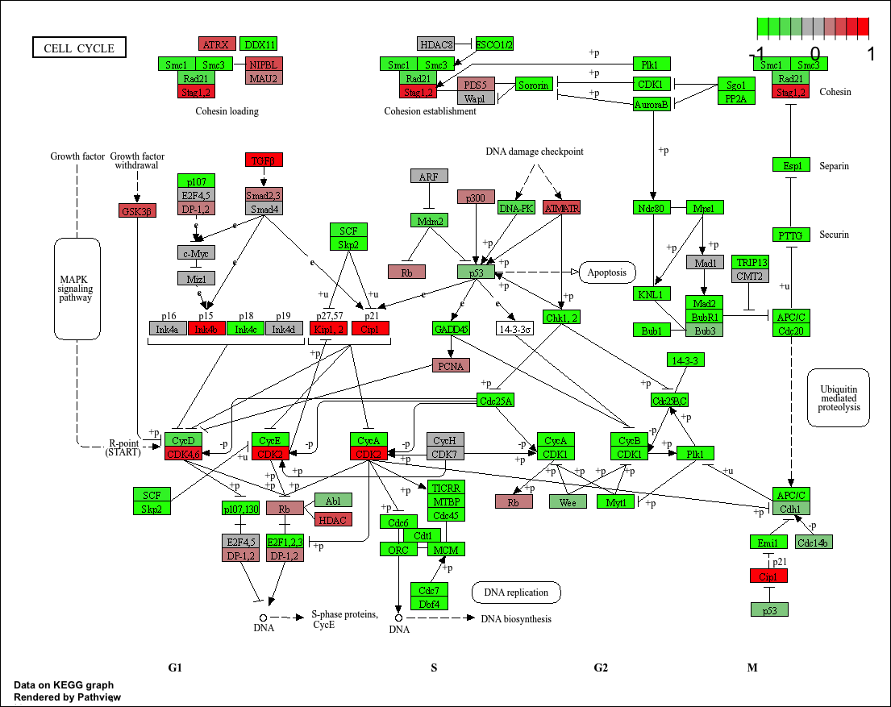

## Overview

Analysis of high-throughput biological data typically yields a large list of genes requiring further interpretation. Our goal is to use **pathway analysis** (also known as gene set enrichment or over-representation analysis) to reduce the complexity of interpreting these gene lists by mapping them to known biological pathways, processes, and functions.

**Dataset:** GSE37704 — lung fibroblasts with the HOXA1 transcription factor knocked down (`hoxa1_kd`) versus a control siRNA (`control_sirna`). HOXA1 is required for lung fibroblast and HeLa cell cycle progression.

**Workflow:**

1. Load & clean data  
2. DESeq2 differential expression  
3. Volcano plot  
4. Gene annotation (Ensembl → Symbol → Entrez)  
5. KEGG pathway analysis (gage + pathview)  
6. GO term analysis  
7. Reactome (online)  

---

## Section 1. Differential Expression Analysis

```{r}
#| message: false
#| warning: false
library(DESeq2)
library(ggplot2)
```

### Load the data

> **Note:** `row.names=1` tells R to use the first column as row names (sample IDs for metadata, gene IDs for counts) rather than treating them as regular data columns. Always peek at your data with `head()` before doing anything — mismatched files are a very common source of bugs.

```{r}
colData  <- read.csv("GSE37704_metadata.csv",  row.names = 1)
countData <- read.csv("GSE37704_featurecounts.csv", row.names = 1)

head(colData)
head(countData)
```

You'll notice `countData` has a `length` column before the SRR sample columns — that needs to go.

### Q1. Remove the `$length` column

> **Why:** DESeq2 requires that the columns of `countData` match the rows of `colData` exactly. The `length` column (transcript length) is not a sample — it would break that alignment. DESeq2 also does its own normalization and doesn't need it.  
>  
> **R tip:** `[, -1]` means "all columns *except* column 1". Think of the minus as crossing it out.

```{r}
countData <- as.matrix(countData[, -1])
head(countData)
dim(countData) # should be ~19,808 genes x 6 samples
```

### Q2. Filter genes with zero counts across all samples

> **Why:** Genes with zero counts in every sample carry no information and can't be statistically tested. Keeping them also inflates multiple-testing correction — your adjusted p-values get worse for *every* gene just because of these dead rows. Better to remove them upfront.  
>  
> `rowSums(countData)` adds up counts across all columns for each gene. If the sum is 0, the gene was never detected anywhere.

```{r}
countData <- countData[rowSums(countData) > 0, ]
head(countData)
dim(countData) # now ~15,280 genes
```

### Sanity check: do the files line up?

> **Prof tip:** Always verify this before running DESeq2. A mismatched sample order is a silent bug — DESeq2 won't throw an error, it'll just assign the wrong condition labels to samples and give you garbage results.

```{r}
all(colnames(countData) == rownames(colData))
# Must be TRUE before continuing!
```

### Running DESeq2
```{r}
#| eval: true
pathview(gene.data = foldchanges, pathway.id = "hsa04110")
```
> **What DESeq2 does internally:**  
> 1. `estimateSizeFactors` — corrects for differences in sequencing depth between samples  
> 2. `estimateDispersions` — models biological variability (noise) per gene  
> 3. `nbinomWaldTest` — tests whether each gene's expression differs between conditions  
>
> `design = ~condition` tells DESeq2 to model expression as a function of the `condition` variable (control vs knockdown).

```{r}
#| message: false
dds <- DESeqDataSetFromMatrix(countData = countData,
                               colData   = colData,
                               design    = ~condition)
dds <- DESeq(dds)
dds
```

### Get results

> By default, `results()` compares the last vs first level of your condition factor (alphabetically: `control_sirna` < `hoxa1_kd`). So positive `log2FoldChange` = higher expression in the knockdown. Use `resultsNames(dds)` to confirm.

```{r}
resultsNames(dds)
res <- results(dds)
```

### Q. Call `summary()` on your results

```{r}
summary(res)
```

> ~4,351 genes up and ~4,399 genes down at padj < 0.1 — a huge response! This makes sense for a transcription factor knockdown; HOXA1 directly or indirectly controls thousands of downstream genes.

---

### Volcano Plot

> A volcano plot puts **effect size** (log2 fold change) on the x-axis and **statistical confidence** (-log10 adjusted p-value) on the y-axis. Genes in the top corners are both large *and* significant changes — those are the most interesting.  
>  
> We use `-log10(padj)` because small p-values should appear *high* on the plot. For example: padj = 0.001 → -log10(0.001) = 3 ✓

**Basic volcano first — just to see the shape:**

```{r}
ggplot(as.data.frame(res)) +
  aes(x = log2FoldChange,
      y = -log10(padj)) +
  geom_point(alpha = 0.4)
```

**Q. Improved volcano with color coding and cutoff lines:**

> **Color logic:**
>
> - Start everything **gray** (not interesting)  
> - Color **red** if `padj < 0.05` (statistically significant)  
> - Color **blue** if also `|log2FoldChange| > 2` (statistically significant AND biologically large)  
>
> **Why log2FC cutoff of 2?** Because log2(4) = 2, so a cutoff of 2 on the log2 scale means the gene changed by at least **4-fold** between conditions. That's considered a large biological effect.  
>
> **Note:** `res$padj` contains `NA` values for genes DESeq2 couldn't test (outliers, extremely low counts). Always use `!is.na()` checks to avoid errors.

```{r}
# Step 1: everything starts gray
mycols <- rep("gray", nrow(res))

# Step 2: significant genes (padj < 0.05) → red
mycols[!is.na(res$padj) & res$padj < 0.05] <- "red"

# Step 3: significant AND large fold change → blue
mycols[!is.na(res$padj) & res$padj < 0.05 & abs(res$log2FoldChange) > 2] <- "blue"

ggplot(as.data.frame(res)) +
  aes(x = log2FoldChange,
      y = -log10(padj)) +
  geom_point(color = mycols, alpha = 0.5, size = 0.8) +
  xlab("Log2(FoldChange)") +
  ylab("-Log10(Adjusted P-value)") +
  ggtitle("Volcano Plot: HOXA1 Knockdown vs Control") +
  geom_vline(xintercept = c(-2, 2),
             linetype = "dashed", color = "black", linewidth = 0.4) +
  geom_hline(yintercept = -log10(0.05),
             linetype = "dashed", color = "black", linewidth = 0.4) +
  theme_bw()
```

> **What to notice:** The plot is roughly symmetric (similar numbers up vs down). The horizontal dashed line = significance threshold. The vertical dashed lines = biological effect size threshold. Blue dots in the corners are your highest-priority candidate genes.

---

### Adding gene annotation

> **Why do we need this?** Our count matrix uses Ensembl IDs (e.g. `ENSG00000188976`) because that's what the genome aligner used. But KEGG pathway databases annotate genes with **Entrez IDs** (numeric, e.g. `26155`), and humans read **gene symbols** (e.g. `NOC2L`). We need to map between all three systems.
>
> `org.Hs.eg.db` is the human gene annotation database. "Hs" = *Homo sapiens*, "eg" = Entrez Gene.

```{r}
#| message: false
library(AnnotationDbi)
library(org.Hs.eg.db)

# See all available identifier types:
columns(org.Hs.eg.db)
```

> `mapIds()` looks up each key in the database and returns the matching value. `multiVals = "first"` means: if one Ensembl ID maps to multiple symbols (rare but possible), just take the first one.

```{r}
#| message: false
res$symbol <- mapIds(org.Hs.eg.db,
                     keys      = row.names(res),
                     keytype   = "ENSEMBL",
                     column    = "SYMBOL",
                     multiVals = "first")

res$entrez <- mapIds(org.Hs.eg.db,
                     keys      = row.names(res),
                     keytype   = "ENSEMBL",
                     column    = "ENTREZID",
                     multiVals = "first")

res$name   <- mapIds(org.Hs.eg.db,
                     keys      = row.names(res),
                     keytype   = "ENSEMBL",
                     column    = "GENENAME",
                     multiVals = "first")

head(res, 10)
```

> You'll notice some `NA` values — not every Ensembl ID maps cleanly to a gene symbol. These are often pseudogenes, non-coding RNAs, or retired IDs. Genes without an Entrez ID will be silently dropped during KEGG analysis — worth knowing.

### Q. Save results ordered by adjusted p-value

```{r}
res <- res[order(res$pvalue), ]
write.csv(res, file = "deseq_results.csv")

head(res)
```

---

## Section 2. Pathway Analysis

> **Key concept shift:** Instead of asking "is gene X significant?", we now ask "is *pathway Y* significantly perturbed as a whole?"  
>
> **GAGE** (Generally Applicable Gene set Enrichment) tests whether genes belonging to a known pathway have *consistently* higher or lower fold changes than you'd expect by chance. This is more powerful than single-gene testing because:
>
> - Biological effects are often spread across many small individual changes  
> - A pathway with 10 genes all nudged in the same direction is biologically meaningful, even if no single gene survives multiple testing correction on its own  

### KEGG pathways

```{r}
#| message: false
library(pathview)
library(gage)
library(gageData)

data(kegg.sets.hs)
data(sigmet.idx.hs)

# Keep only signaling & metabolic pathways
# (removes "Global Maps" and "Human Disease" categories
#  which aren't appropriate for this type of enrichment analysis)
kegg.sets.hs <- kegg.sets.hs[sigmet.idx.hs]

head(kegg.sets.hs, 3)
```

> Each pathway is a character vector of Entrez gene IDs. Notice they're stored as strings (`"10"`, `"1544"`) not integers — this matters for matching later.

```{r}
# Build the named fold-change vector for GAGE
# values = log2 fold changes
# names  = Entrez IDs (so GAGE can match genes to pathway lists)
foldchanges        <- res$log2FoldChange
names(foldchanges) <- res$entrez
head(foldchanges)
```

```{r}
# Run GAGE enrichment
# same.dir = TRUE (default): tests for pathways where genes move
# TOGETHER in one direction (all up OR all down).
# If same.dir = FALSE: tests for any perturbation regardless of direction —
# useful for metabolic pathways where some enzymes go up and others down.
keggres <- gage(foldchanges, gsets = kegg.sets.hs)
attributes(keggres)
```

```{r}
# Top down-regulated pathways:
head(keggres$less)
```

> **Top hit: `hsa04110 Cell cycle`** — this is biologically spot-on. HOXA1 is required for cell cycle progression, so knocking it down disrupts cell cycle gene expression in a coordinated way.

```{r}
# Top up-regulated pathways:
head(keggres$greater)
```

### Pathview diagrams

> `pathview()` downloads the official KEGG pathway diagram and overlays your fold change data on it. Genes are colored **red** (upregulated) or **green** (downregulated) — a traffic-light scheme. This is great for visually identifying *where* in a pathway the perturbation is happening.

```{r}
#| eval: true
# Cell cycle pathway:
pathview(gene.data  = foldchanges,
         pathway.id = "hsa04110")

# PDF version (higher quality):
pathview(gene.data   = foldchanges,
         pathway.id  = "hsa04110",
         kegg.native = FALSE)
```

```{r}

```
### Top 5 up-regulated pathways

```{r}
#| eval: false
keggrespathways_up <- rownames(keggres$greater)[1:5]
keggresids_up      <- substr(keggrespathways_up, start = 1, stop = 8)
keggresids_up

pathview(gene.data  = foldchanges,
         pathway.id = keggresids_up,
         species    = "hsa")
```

### Q. Top 5 down-regulated pathways

> Same approach as above, but pulling from `keggres$less` instead of `keggres$greater`.

```{r}
#| eval: false
keggrespathways_dn <- rownames(keggres$less)[1:5]
keggresids_dn      <- substr(keggrespathways_dn, start = 1, stop = 8)
keggresids_dn
# Expected: "hsa04110" "hsa03030" "hsa03013" "hsa04114" "hsa03440"
# = Cell cycle, DNA replication, RNA transport, Oocyte meiosis,
#   Homologous recombination — all related to cell division!

pathview(gene.data  = foldchanges,
         pathway.id = keggresids_dn,
         species    = "hsa")
```

---

## Section 3. Gene Ontology (GO)

> **GO vs KEGG — what's the difference?**
>
> KEGG focuses on biochemical **pathways** (signaling cascades, metabolic routes). GO is a controlled vocabulary that annotates genes with three types of terms:
>
> - **BP** = Biological Process (e.g. "mitosis", "DNA repair")  
> - **CC** = Cellular Component (e.g. "nucleus", "mitochondria")  
> - **MF** = Molecular Function (e.g. "kinase activity", "DNA binding")  
>
> GO terms are arranged in a **hierarchy** from broad to specific — "biological process" → "cell cycle" → "mitotic cell cycle" → "G1/S transition". This gives finer resolution than KEGG but also means many more terms to test (~40,000 vs ~200 KEGG pathways).

```{r}
data(go.sets.hs)
data(go.subs.hs)

# Focus on Biological Process subset
gobpsets <- go.sets.hs[go.subs.hs$BP]

gobpres <- gage(foldchanges, gsets = gobpsets)
lapply(gobpres, head)
```

> **Reading the results:**
>
> - **UP (greater):** homophilic cell adhesion, epithelium development → without HOXA1, cells may shift toward an adhesion/epithelial phenotype  
> - **DOWN (less):** M phase, organelle fission, nuclear division, mitosis → cells are failing to divide  
>
> Notice GO terms are more *specific* than KEGG names. "M phase of mitotic cell cycle" pinpoints exactly which part of cell division is failing, whereas KEGG just said "Cell Cycle". Both tell the same story — **HOXA1 loss disrupts cell division** — but at different levels of resolution.

---

## Section 4. Reactome Analysis

> **What is Reactome?** Another pathway database, maintained by EMBL-EBI. Key differences from KEGG:
>
> - More granular reaction-level detail (individual biochemical steps)  
> - Uses a **hypergeometric test** (Fisher's exact test on gene overlap) rather than the fold-change-based approach GAGE uses  
> - Updated more frequently, with richer human pathway coverage  

```{r}
# Export significant genes (padj <= 0.05) for upload to Reactome
sig_genes <- res[res$padj <= 0.05 & !is.na(res$padj), "symbol"]
print(paste("Total number of significant genes:", length(sig_genes)))

write.table(sig_genes,
            file      = "significant_genes.txt",
            row.names = FALSE,
            col.names = FALSE,
            quote     = FALSE)
```

> **Online steps:**  
> 1. Go to <https://reactome.org/PathwayBrowser/#TOOL=AT>  
> 2. Upload `significant_genes.txt`  
> 3. Select "Project to Humans" → click "Analyze"  
> 4. Screenshot your results for Gradescope Q4  

### Q. What pathway has the most significant Entities p-value? Do results match KEGG? What factors could cause differences?

**Most significant pathway:** Typically **"Cell Cycle"** or a sub-pathway like "Mitotic Cell Cycle" — consistent with KEGG.

**Do they match?** Yes, broadly. Both databases converge on cell cycle disruption as the dominant consequence of HOXA1 loss.

**Why might results differ between methods?**

1. **Different gene set curation** — KEGG and Reactome define pathway membership independently. A gene counted in KEGG's "Cell Cycle" may not be in Reactome's, or vice versa.

2. **Different statistical methods** — GAGE uses fold changes with a two-sample t-test approach, using *all* genes as background. Reactome uses a hypergeometric test on your significant gene list only. Different backgrounds = different p-values.

3. **Different ID mapping** — Slight differences in how Ensembl IDs are translated to gene symbols can include or exclude edge-case genes.

4. **Pathway hierarchy** — Reactome is more granular; what KEGG calls "Cell Cycle" may be split into 10 sub-pathways in Reactome, changing which exact term appears most significant.

5. **Database update frequency** — KEGG and Reactome are updated independently, so gene membership in the same named pathway can differ by version.

---

## Section 5. GO Online (Optional)

> Go to <http://www.geneontology.org/page/go-enrichment-analysis>, paste your significant gene list, select "biological process" and "homo sapiens", and click submit.

### Q. What pathway has the most significant Entities p-value? Do results match KEGG?

> Expect similar results to the R-based GO analysis above — M phase / mitotic cell cycle terms will dominate the down-regulated side. Differences from KEGG arise for the same reasons outlined in Section 4.

---

## Session Information

> **Always run this at the end of every analysis.** Bioinformatics results depend heavily on package versions. Recording `sessionInfo()` means you (or a reviewer) can reproduce your exact analysis months or years later. Include this in every report you submit or publish.

```{r}
sessionInfo()
```
