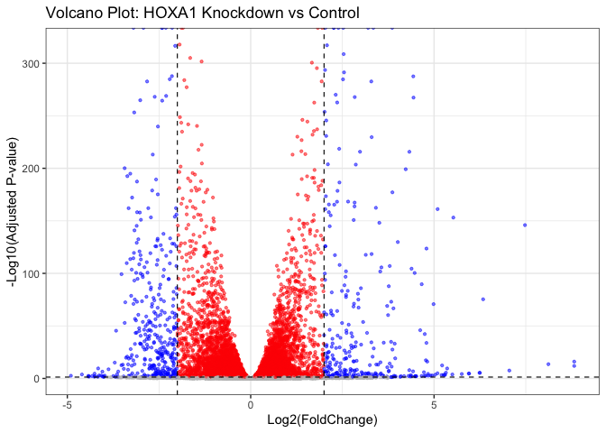

# Class 14: Pathway Analysis from RNA-Seq Results
Omar Siddiqui
2026-05-16

## Overview

Pathway analysis aims to reduce the complexity of interpreting large
gene lists by mapping them to known biological pathways and processes.
Here we use DESeq2 for differential expression, then GAGE for KEGG
pathway enrichment, and finally explore Gene Ontology (GO) and Reactome
for further biological insight.

------------------------------------------------------------------------

## Section 1. Differential Expression Analysis

``` r
library(DESeq2)
library(ggplot2)
```

### Load the data

``` r
# row.names=1 sets the first column as row names instead of a data column
colData  <- read.csv("GSE37704_metadata.csv",  row.names = 1)
countData <- read.csv("GSE37704_featurecounts.csv", row.names = 1)

head(colData)
```

                  condition
    SRR493366 control_sirna
    SRR493367 control_sirna
    SRR493368 control_sirna
    SRR493369      hoxa1_kd
    SRR493370      hoxa1_kd
    SRR493371      hoxa1_kd

``` r
head(countData)
```

                    length SRR493366 SRR493367 SRR493368 SRR493369 SRR493370
    ENSG00000186092    918         0         0         0         0         0
    ENSG00000279928    718         0         0         0         0         0
    ENSG00000279457   1982        23        28        29        29        28
    ENSG00000278566    939         0         0         0         0         0
    ENSG00000273547    939         0         0         0         0         0
    ENSG00000187634   3214       124       123       205       207       212
                    SRR493371
    ENSG00000186092         0
    ENSG00000279928         0
    ENSG00000279457        46
    ENSG00000278566         0
    ENSG00000273547         0
    ENSG00000187634       258

### Q1. Remove the `$length` column

The `length` column is transcript length info — not a sample. We remove
it so `countData` columns match `colData` rows exactly, as DESeq2
requires.

``` r
# -1 removes the first column (length)
countData <- as.matrix(countData[, -1])
head(countData)
```

                    SRR493366 SRR493367 SRR493368 SRR493369 SRR493370 SRR493371
    ENSG00000186092         0         0         0         0         0         0
    ENSG00000279928         0         0         0         0         0         0
    ENSG00000279457        23        28        29        29        28        46
    ENSG00000278566         0         0         0         0         0         0
    ENSG00000273547         0         0         0         0         0         0
    ENSG00000187634       124       123       205       207       212       258

### Q2. Filter zero-count genes

Genes with zero counts across all samples can’t be tested and hurt our
multiple-testing correction, so we remove them upfront.

``` r
# rowSums > 0 keeps only genes detected in at least one sample
countData <- countData[rowSums(countData) > 0, ]
head(countData)
```

                    SRR493366 SRR493367 SRR493368 SRR493369 SRR493370 SRR493371
    ENSG00000279457        23        28        29        29        28        46
    ENSG00000187634       124       123       205       207       212       258
    ENSG00000188976      1637      1831      2383      1226      1326      1504
    ENSG00000187961       120       153       180       236       255       357
    ENSG00000187583        24        48        65        44        48        64
    ENSG00000187642         4         9        16        14        16        16

### Run DESeq2

``` r
# Always check files line up before running — mismatched order = wrong results
all(colnames(countData) == rownames(colData))
```

    [1] TRUE

``` r
dds <- DESeqDataSetFromMatrix(countData = countData,
                               colData   = colData,
                               design    = ~condition)
```

    Warning in DESeqDataSet(se, design = design, ignoreRank): some variables in
    design formula are characters, converting to factors

``` r
dds <- DESeq(dds)
```

### Get results

``` r
# Positive log2FoldChange = higher in hoxa1_kd vs control_sirna
res <- results(dds)
summary(res)
```


    out of 15975 with nonzero total read count
    adjusted p-value < 0.1
    LFC > 0 (up)       : 4349, 27%
    LFC < 0 (down)     : 4396, 28%
    outliers [1]       : 0, 0%
    low counts [2]     : 1237, 7.7%
    (mean count < 0)
    [1] see 'cooksCutoff' argument of ?results
    [2] see 'independentFiltering' argument of ?results

### Volcano Plot

``` r
# Color scheme: gray = not significant, red = padj < 0.05,
# blue = padj < 0.05 AND |log2FC| > 2 (significant + large effect)
mycols <- rep("gray", nrow(res))
mycols[!is.na(res$padj) & res$padj < 0.05] <- "red"
mycols[!is.na(res$padj) & res$padj < 0.05 & abs(res$log2FoldChange) > 2] <- "blue"

ggplot(as.data.frame(res)) +
  aes(x = log2FoldChange,
      y = -log10(padj)) +
  geom_point(color = mycols, alpha = 0.5, size = 0.8) +
  xlab("Log2(FoldChange)") +
  ylab("-Log10(Adjusted P-value)") +
  ggtitle("Volcano Plot: HOXA1 Knockdown vs Control") +
  geom_vline(xintercept = c(-2, 2), linetype = "dashed", linewidth = 0.4) +
  geom_hline(yintercept = -log10(0.05), linetype = "dashed", linewidth = 0.4) +
  theme_bw()
```



### Add gene annotations

``` r
# We need SYMBOL for readability, ENTREZID for KEGG, GENENAME for context
library(AnnotationDbi)
library(org.Hs.eg.db)

res$symbol <- mapIds(org.Hs.eg.db,
                     keys      = row.names(res),
                     keytype   = "ENSEMBL",
                     column    = "SYMBOL",
                     multiVals = "first")

res$entrez <- mapIds(org.Hs.eg.db,
                     keys      = row.names(res),
                     keytype   = "ENSEMBL",
                     column    = "ENTREZID",
                     multiVals = "first")

res$name   <- mapIds(org.Hs.eg.db,
                     keys      = row.names(res),
                     keytype   = "ENSEMBL",
                     column    = "GENENAME",
                     multiVals = "first")

head(res, 10)
```

    log2 fold change (MLE): condition hoxa1 kd vs control sirna 
    Wald test p-value: condition hoxa1 kd vs control sirna 
    DataFrame with 10 rows and 9 columns
                       baseMean log2FoldChange     lfcSE       stat      pvalue
                      <numeric>      <numeric> <numeric>  <numeric>   <numeric>
    ENSG00000279457   29.913579      0.1792571 0.3248215   0.551863 5.81042e-01
    ENSG00000187634  183.229650      0.4264571 0.1402658   3.040350 2.36304e-03
    ENSG00000188976 1651.188076     -0.6927205 0.0548465 -12.630156 1.43993e-36
    ENSG00000187961  209.637938      0.7297556 0.1318599   5.534326 3.12428e-08
    ENSG00000187583   47.255123      0.0405765 0.2718928   0.149237 8.81366e-01
    ENSG00000187642   11.979750      0.5428105 0.5215598   1.040744 2.97994e-01
    ENSG00000188290  108.922128      2.0570638 0.1969053  10.446970 1.51281e-25
    ENSG00000187608  350.716868      0.2573837 0.1027266   2.505522 1.22271e-02
    ENSG00000188157 9128.439422      0.3899088 0.0467164   8.346302 7.04333e-17
    ENSG00000237330    0.158192      0.7859552 4.0804729   0.192614 8.47261e-01
                           padj      symbol      entrez                   name
                      <numeric> <character> <character>            <character>
    ENSG00000279457 6.86555e-01          NA          NA                     NA
    ENSG00000187634 5.15718e-03      SAMD11      148398 sterile alpha motif ..
    ENSG00000188976 1.76553e-35       NOC2L       26155 NOC2 like nucleolar ..
    ENSG00000187961 1.13413e-07      KLHL17      339451 kelch like family me..
    ENSG00000187583 9.19031e-01     PLEKHN1       84069 pleckstrin homology ..
    ENSG00000187642 4.03379e-01       PERM1       84808 PPARGC1 and ESRR ind..
    ENSG00000188290 1.30538e-24        HES4       57801 hes family bHLH tran..
    ENSG00000187608 2.37452e-02       ISG15        9636 ISG15 ubiquitin like..
    ENSG00000188157 4.21970e-16        AGRN      375790                  agrin
    ENSG00000237330          NA      RNF223      401934 ring finger protein ..

### Save results

``` r
res <- res[order(res$pvalue), ]
write.csv(res, file = "deseq_results.csv")
```

------------------------------------------------------------------------

## Section 2. Pathway Analysis

GAGE tests whether genes in a known pathway change together in a
coordinated direction — more powerful than testing individual genes.

``` r
library(pathview)
library(gage)
library(gageData)

data(kegg.sets.hs)
data(sigmet.idx.hs)

# Focus on signaling and metabolic pathways only
kegg.sets.hs <- kegg.sets.hs[sigmet.idx.hs]

# GAGE needs a named vector: values = fold changes, names = Entrez IDs
foldchanges        <- res$log2FoldChange
names(foldchanges) <- res$entrez

# same.dir = TRUE tests for pathways moving consistently up OR down
keggres <- gage(foldchanges, gsets = kegg.sets.hs)
```

``` r
head(keggres$less)    # top down-regulated pathways
```

                                             p.geomean stat.mean        p.val
    hsa04110 Cell cycle                   8.995727e-06 -4.378644 8.995727e-06
    hsa03030 DNA replication              9.424076e-05 -3.951803 9.424076e-05
    hsa03013 RNA transport                1.375901e-03 -3.028500 1.375901e-03
    hsa03440 Homologous recombination     3.066756e-03 -2.852899 3.066756e-03
    hsa04114 Oocyte meiosis               3.784520e-03 -2.698128 3.784520e-03
    hsa00010 Glycolysis / Gluconeogenesis 8.961413e-03 -2.405398 8.961413e-03
                                                q.val set.size         exp1
    hsa04110 Cell cycle                   0.001448312      121 8.995727e-06
    hsa03030 DNA replication              0.007586381       36 9.424076e-05
    hsa03013 RNA transport                0.073840037      144 1.375901e-03
    hsa03440 Homologous recombination     0.121861535       28 3.066756e-03
    hsa04114 Oocyte meiosis               0.121861535      102 3.784520e-03
    hsa00010 Glycolysis / Gluconeogenesis 0.212222694       53 8.961413e-03

``` r
head(keggres$greater) # top up-regulated pathways
```

                                            p.geomean stat.mean       p.val
    hsa04640 Hematopoietic cell lineage   0.002822776  2.833362 0.002822776
    hsa04630 Jak-STAT signaling pathway   0.005202070  2.585673 0.005202070
    hsa00140 Steroid hormone biosynthesis 0.007255099  2.526744 0.007255099
    hsa04142 Lysosome                     0.010107392  2.338364 0.010107392
    hsa04330 Notch signaling pathway      0.018747253  2.111725 0.018747253
    hsa04916 Melanogenesis                0.019399766  2.081927 0.019399766
                                              q.val set.size        exp1
    hsa04640 Hematopoietic cell lineage   0.3893570       55 0.002822776
    hsa04630 Jak-STAT signaling pathway   0.3893570      109 0.005202070
    hsa00140 Steroid hormone biosynthesis 0.3893570       31 0.007255099
    hsa04142 Lysosome                     0.4068225      118 0.010107392
    hsa04330 Notch signaling pathway      0.4391731       46 0.018747253
    hsa04916 Melanogenesis                0.4391731       90 0.019399766

### Pathview — Cell Cycle pathway

``` r
# Downloads the KEGG pathway diagram and colors genes by fold change
pathview(gene.data = foldchanges, pathway.id = "hsa04110")
```

``` r
knitr::include_graphics("hsa04110.pathview.png")
```


### Top 5 up-regulated pathways

``` r
keggrespathways_up <- rownames(keggres$greater)[1:5]
keggresids_up      <- substr(keggrespathways_up, start = 1, stop = 8)
keggresids_up
```

    [1] "hsa04640" "hsa04630" "hsa00140" "hsa04142" "hsa04330"

``` r
pathview(gene.data = foldchanges, pathway.id = keggresids_up, species = "hsa")
```

### Q. Top 5 down-regulated pathways

``` r
# Same approach as above but from keggres$less
keggrespathways_dn <- rownames(keggres$less)[1:5]
keggresids_dn      <- substr(keggrespathways_dn, start = 1, stop = 8)
keggresids_dn
```

    [1] "hsa04110" "hsa03030" "hsa03013" "hsa03440" "hsa04114"

``` r
pathview(gene.data = foldchanges, pathway.id = keggresids_dn, species = "hsa")
```

------------------------------------------------------------------------

## Section 3. Gene Ontology (GO)

GO annotates genes with Biological Process (BP), Cellular Component
(CC), and Molecular Function (MF) terms. Here we focus on BP, which
gives finer resolution than KEGG (thousands of terms vs ~200 pathways).

``` r
data(go.sets.hs)
data(go.subs.hs)

gobpsets <- go.sets.hs[go.subs.hs$BP]
gobpres  <- gage(foldchanges, gsets = gobpsets)

lapply(gobpres, head)
```

    $greater
                                                 p.geomean stat.mean        p.val
    GO:0007156 homophilic cell adhesion       8.519724e-05  3.824205 8.519724e-05
    GO:0002009 morphogenesis of an epithelium 1.396681e-04  3.653886 1.396681e-04
    GO:0048729 tissue morphogenesis           1.432451e-04  3.643242 1.432451e-04
    GO:0007610 behavior                       1.925222e-04  3.565432 1.925222e-04
    GO:0060562 epithelial tube morphogenesis  5.932837e-04  3.261376 5.932837e-04
    GO:0035295 tube development               5.953254e-04  3.253665 5.953254e-04
                                                  q.val set.size         exp1
    GO:0007156 homophilic cell adhesion       0.1951953      113 8.519724e-05
    GO:0002009 morphogenesis of an epithelium 0.1951953      339 1.396681e-04
    GO:0048729 tissue morphogenesis           0.1951953      424 1.432451e-04
    GO:0007610 behavior                       0.1967577      426 1.925222e-04
    GO:0060562 epithelial tube morphogenesis  0.3565320      257 5.932837e-04
    GO:0035295 tube development               0.3565320      391 5.953254e-04

    $less
                                                p.geomean stat.mean        p.val
    GO:0048285 organelle fission             1.536227e-15 -8.063910 1.536227e-15
    GO:0000280 nuclear division              4.286961e-15 -7.939217 4.286961e-15
    GO:0007067 mitosis                       4.286961e-15 -7.939217 4.286961e-15
    GO:0000087 M phase of mitotic cell cycle 1.169934e-14 -7.797496 1.169934e-14
    GO:0007059 chromosome segregation        2.028624e-11 -6.878340 2.028624e-11
    GO:0000236 mitotic prometaphase          1.729553e-10 -6.695966 1.729553e-10
                                                    q.val set.size         exp1
    GO:0048285 organelle fission             5.841698e-12      376 1.536227e-15
    GO:0000280 nuclear division              5.841698e-12      352 4.286961e-15
    GO:0007067 mitosis                       5.841698e-12      352 4.286961e-15
    GO:0000087 M phase of mitotic cell cycle 1.195672e-11      362 1.169934e-14
    GO:0007059 chromosome segregation        1.658603e-08      142 2.028624e-11
    GO:0000236 mitotic prometaphase          1.178402e-07       84 1.729553e-10

    $stats
                                              stat.mean     exp1
    GO:0007156 homophilic cell adhesion        3.824205 3.824205
    GO:0002009 morphogenesis of an epithelium  3.653886 3.653886
    GO:0048729 tissue morphogenesis            3.643242 3.643242
    GO:0007610 behavior                        3.565432 3.565432
    GO:0060562 epithelial tube morphogenesis   3.261376 3.261376
    GO:0035295 tube development                3.253665 3.253665

------------------------------------------------------------------------

## Section 4. Reactome Analysis

``` r
# Export significant genes for upload to Reactome website
sig_genes <- res[res$padj <= 0.05 & !is.na(res$padj), "symbol"]
print(paste("Total number of significant genes:", length(sig_genes)))
```

    [1] "Total number of significant genes: 8147"

``` r
write.table(sig_genes,
            file      = "significant_genes.txt",
            row.names = FALSE,
            col.names = FALSE,
            quote     = FALSE)
```

Upload `significant_genes.txt` to
<https://reactome.org/PathwayBrowser/#TOOL=AT>, select “Project to
Humans” and click Analyze.

``` r
knitr::include_graphics("reactome_screenshot.png")
```


### Q. What pathway has the most significant Entities p-value? Do results match KEGG? What factors could cause differences?

The most significant pathway is **Cell Cycle / Mitotic Cell Cycle**,
consistent with our KEGG results. Both methods converge on cell division
disruption as the main consequence of HOXA1 loss.

Differences between methods can arise from:

1.  **Different gene set curation** — pathway membership is defined
    independently in each database
2.  **Different statistical methods** — GAGE uses fold changes across
    all genes; Reactome uses a hypergeometric test on the significant
    gene list only
3.  **Different ID mapping** — small differences in Ensembl to symbol
    conversion can include or exclude genes
4.  **Pathway hierarchy** — Reactome is more granular, splitting one
    KEGG pathway into many sub-pathways
5.  **Database update frequency** — each database is updated on its own
    schedule, so gene membership can differ

------------------------------------------------------------------------

## Session Information

``` r
sessionInfo()
```

    R version 4.5.3 (2026-03-11)
    Platform: aarch64-apple-darwin20
    Running under: macOS Tahoe 26.5.1

    Matrix products: default
    BLAS:   /Library/Frameworks/R.framework/Versions/4.5-arm64/Resources/lib/libRblas.0.dylib 
    LAPACK: /Library/Frameworks/R.framework/Versions/4.5-arm64/Resources/lib/libRlapack.dylib;  LAPACK version 3.12.1

    locale:
    [1] en_US.UTF-8/en_US.UTF-8/en_US.UTF-8/C/en_US.UTF-8/en_US.UTF-8

    time zone: America/Los_Angeles
    tzcode source: internal

    attached base packages:
    [1] stats4    stats     graphics  grDevices utils     datasets  methods  
    [8] base     

    other attached packages:
     [1] gageData_2.48.0             gage_2.60.0                
     [3] pathview_1.50.0             org.Hs.eg.db_3.22.0        
     [5] AnnotationDbi_1.72.0        ggplot2_4.0.3              
     [7] DESeq2_1.50.2               SummarizedExperiment_1.40.0
     [9] Biobase_2.70.0              MatrixGenerics_1.22.0      
    [11] matrixStats_1.5.0           GenomicRanges_1.62.1       
    [13] Seqinfo_1.0.0               IRanges_2.44.0             
    [15] S4Vectors_0.48.1            BiocGenerics_0.56.0        
    [17] generics_0.1.4             

    loaded via a namespace (and not attached):
     [1] KEGGREST_1.50.0     gtable_0.3.6        xfun_0.57          
     [4] lattice_0.22-9      bitops_1.0-9        vctrs_0.7.3        
     [7] tools_4.5.3         parallel_4.5.3      tibble_3.3.1       
    [10] RSQLite_3.53.1      blob_1.3.0          pkgconfig_2.0.3    
    [13] Matrix_1.7-5        RColorBrewer_1.1-3  S7_0.2.2           
    [16] graph_1.88.1        lifecycle_1.0.5     compiler_4.5.3     
    [19] farver_2.1.2        Biostrings_2.78.0   codetools_0.2-20   
    [22] htmltools_0.5.9     RCurl_1.98-1.18     yaml_2.3.12        
    [25] GO.db_3.22.0        crayon_1.5.3        pillar_1.11.1      
    [28] BiocParallel_1.44.0 DelayedArray_0.36.1 cachem_1.1.0       
    [31] abind_1.4-8         tidyselect_1.2.1    locfit_1.5-9.12    
    [34] digest_0.6.39       dplyr_1.2.1         labeling_0.4.3     
    [37] fastmap_1.2.0       grid_4.5.3          cli_3.6.6          
    [40] SparseArray_1.10.10 magrittr_2.0.5      S4Arrays_1.10.1    
    [43] XML_3.99-0.23       withr_3.0.2         scales_1.4.0       
    [46] bit64_4.8.2         rmarkdown_2.31      XVector_0.50.0     
    [49] httr_1.4.8          bit_4.6.0           otel_0.2.0         
    [52] png_0.1-9           memoise_2.0.1       evaluate_1.0.5     
    [55] knitr_1.51          rlang_1.2.0         Rcpp_1.1.1-1.1     
    [58] glue_1.8.1          DBI_1.3.0           Rgraphviz_2.54.0   
    [61] KEGGgraph_1.70.0    rstudioapi_0.18.0   jsonlite_2.0.0     
    [64] R6_2.6.1           
