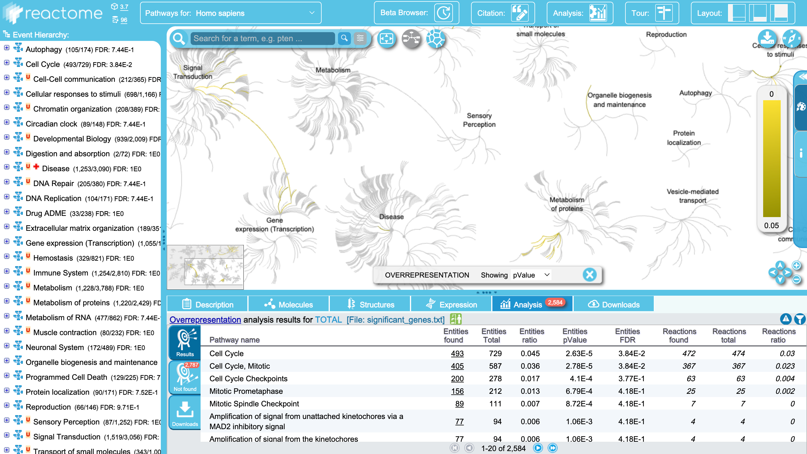

## Overview

Pathway analysis aims to reduce the complexity of interpreting large gene lists by mapping them to known biological pathways and processes. Here we use DESeq2 for differential expression, then GAGE for KEGG pathway enrichment, and finally explore Gene Ontology (GO) and Reactome for further biological insight.

---

## Section 1. Differential Expression Analysis

```{r}
#| message: false
#| warning: false
library(DESeq2)
library(ggplot2)
```

### Load the data

```{r}
# row.names=1 sets the first column as row names instead of a data column
colData  <- read.csv("GSE37704_metadata.csv",  row.names = 1)
countData <- read.csv("GSE37704_featurecounts.csv", row.names = 1)

head(colData)
head(countData)
```

### Q1. Remove the `$length` column

The `length` column is transcript length info — not a sample. We remove it so
`countData` columns match `colData` rows exactly, as DESeq2 requires.

```{r}
# -1 removes the first column (length)
countData <- as.matrix(countData[, -1])
head(countData)
```

### Q2. Filter zero-count genes

Genes with zero counts across all samples can't be tested and hurt our
multiple-testing correction, so we remove them upfront.

```{r}
# rowSums > 0 keeps only genes detected in at least one sample
countData <- countData[rowSums(countData) > 0, ]
head(countData)
```

### Run DESeq2

```{r}
#| message: false
# Always check files line up before running — mismatched order = wrong results
all(colnames(countData) == rownames(colData))

dds <- DESeqDataSetFromMatrix(countData = countData,
                               colData   = colData,
                               design    = ~condition)
dds <- DESeq(dds)
```

### Get results

```{r}
# Positive log2FoldChange = higher in hoxa1_kd vs control_sirna
res <- results(dds)
summary(res)
```

### Volcano Plot

```{r}
#| warning: false
# Color scheme: gray = not significant, red = padj < 0.05,
# blue = padj < 0.05 AND |log2FC| > 2 (significant + large effect)
mycols <- rep("gray", nrow(res))
mycols[!is.na(res$padj) & res$padj < 0.05] <- "red"
mycols[!is.na(res$padj) & res$padj < 0.05 & abs(res$log2FoldChange) > 2] <- "blue"

ggplot(as.data.frame(res)) +
  aes(x = log2FoldChange,
      y = -log10(padj)) +
  geom_point(color = mycols, alpha = 0.5, size = 0.8) +
  xlab("Log2(FoldChange)") +
  ylab("-Log10(Adjusted P-value)") +
  ggtitle("Volcano Plot: HOXA1 Knockdown vs Control") +
  geom_vline(xintercept = c(-2, 2), linetype = "dashed", linewidth = 0.4) +
  geom_hline(yintercept = -log10(0.05), linetype = "dashed", linewidth = 0.4) +
  theme_bw()
```

### Add gene annotations

```{r}
#| message: false
#| warning: false
# We need SYMBOL for readability, ENTREZID for KEGG, GENENAME for context
library(AnnotationDbi)
library(org.Hs.eg.db)

res$symbol <- mapIds(org.Hs.eg.db,
                     keys      = row.names(res),
                     keytype   = "ENSEMBL",
                     column    = "SYMBOL",
                     multiVals = "first")

res$entrez <- mapIds(org.Hs.eg.db,
                     keys      = row.names(res),
                     keytype   = "ENSEMBL",
                     column    = "ENTREZID",
                     multiVals = "first")

res$name   <- mapIds(org.Hs.eg.db,
                     keys      = row.names(res),
                     keytype   = "ENSEMBL",
                     column    = "GENENAME",
                     multiVals = "first")

head(res, 10)
```

### Save results

```{r}
res <- res[order(res$pvalue), ]
write.csv(res, file = "deseq_results.csv")
```

---

## Section 2. Pathway Analysis

GAGE tests whether genes in a known pathway change together in a coordinated
direction — more powerful than testing individual genes.

```{r}
#| message: false
#| warning: false
library(pathview)
library(gage)
library(gageData)

data(kegg.sets.hs)
data(sigmet.idx.hs)

# Focus on signaling and metabolic pathways only
kegg.sets.hs <- kegg.sets.hs[sigmet.idx.hs]

# GAGE needs a named vector: values = fold changes, names = Entrez IDs
foldchanges        <- res$log2FoldChange
names(foldchanges) <- res$entrez

# same.dir = TRUE tests for pathways moving consistently up OR down
keggres <- gage(foldchanges, gsets = kegg.sets.hs)
```

```{r}
head(keggres$less)    # top down-regulated pathways
head(keggres$greater) # top up-regulated pathways
```

### Pathview — Cell Cycle pathway

```{r}
#| message: false
#| warning: false
# Downloads the KEGG pathway diagram and colors genes by fold change
pathview(gene.data = foldchanges, pathway.id = "hsa04110")
```

```{r}
knitr::include_graphics("hsa04110.pathview.png")
```

### Top 5 up-regulated pathways

```{r}
#| message: false
#| warning: false
keggrespathways_up <- rownames(keggres$greater)[1:5]
keggresids_up      <- substr(keggrespathways_up, start = 1, stop = 8)
keggresids_up

pathview(gene.data = foldchanges, pathway.id = keggresids_up, species = "hsa")
```

### Q. Top 5 down-regulated pathways

```{r}
#| message: false
#| warning: false
# Same approach as above but from keggres$less
keggrespathways_dn <- rownames(keggres$less)[1:5]
keggresids_dn      <- substr(keggrespathways_dn, start = 1, stop = 8)
keggresids_dn

pathview(gene.data = foldchanges, pathway.id = keggresids_dn, species = "hsa")
```

---

## Section 3. Gene Ontology (GO)

GO annotates genes with Biological Process (BP), Cellular Component (CC), and
Molecular Function (MF) terms. Here we focus on BP, which gives finer resolution
than KEGG (thousands of terms vs ~200 pathways).

```{r}
data(go.sets.hs)
data(go.subs.hs)

gobpsets <- go.sets.hs[go.subs.hs$BP]
gobpres  <- gage(foldchanges, gsets = gobpsets)

lapply(gobpres, head)
```

---

## Section 4. Reactome Analysis

```{r}
# Export significant genes for upload to Reactome website
sig_genes <- res[res$padj <= 0.05 & !is.na(res$padj), "symbol"]
print(paste("Total number of significant genes:", length(sig_genes)))

write.table(sig_genes,
            file      = "significant_genes.txt",
            row.names = FALSE,
            col.names = FALSE,
            quote     = FALSE)
```

Upload `significant_genes.txt` to <https://reactome.org/PathwayBrowser/#TOOL=AT>,
select "Project to Humans" and click Analyze.

```{r}

```

### Q. What pathway has the most significant Entities p-value? Do results match KEGG? What factors could cause differences?

The most significant pathway is **Cell Cycle / Mitotic Cell Cycle**, consistent
with our KEGG results. Both methods converge on cell division disruption as the
main consequence of HOXA1 loss.

Differences between methods can arise from:

1. **Different gene set curation** — pathway membership is defined independently in each database
2. **Different statistical methods** — GAGE uses fold changes across all genes; Reactome uses a hypergeometric test on the significant gene list only
3. **Different ID mapping** — small differences in Ensembl to symbol conversion can include or exclude genes
4. **Pathway hierarchy** — Reactome is more granular, splitting one KEGG pathway into many sub-pathways
5. **Database update frequency** — each database is updated on its own schedule, so gene membership can differ

---

## Session Information

```{r}
sessionInfo()
```
