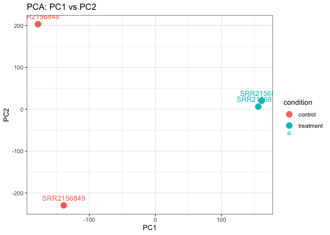
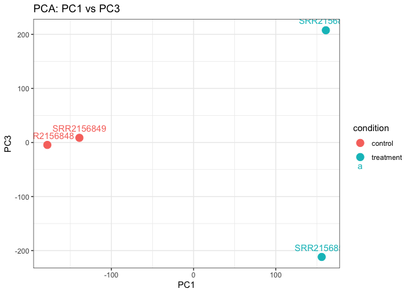
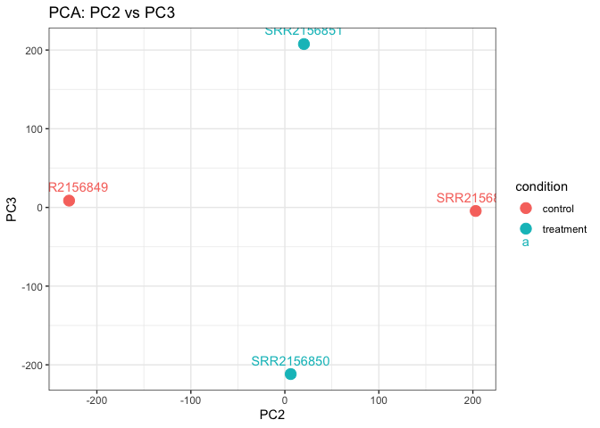

# Lab 17: RNA-Seq Quantification
Omar Siddiqui (PID: A19093654)
2026-05-31

## RNA-Seq Quantification and PCA Analysis

First, we load the required libraries and import the abundance data
using `tximport`:

``` r
setwd("/Users/omar")
library(tximport)

folders <- dir(pattern="SRR21568*")
files <- file.path(folders, "abundance.h5")
names(files) <- sub("_quant", "", folders)

txi <- tximport(files, type="kallisto", txOut=TRUE)
```

## Filtering

Remove transcripts with no reads and no variation:

``` r
to.keep <- rowSums(txi$counts) > 0
kset.nonzero <- txi$counts[to.keep,]

keep2 <- apply(kset.nonzero, 1, sd) > 0
x <- kset.nonzero[keep2,]
```

## PCA

``` r
pca <- prcomp(t(x), scale=TRUE)
summary(pca)
```

    Importance of components:
                                PC1      PC2      PC3   PC4
    Standard deviation     183.6379 177.3605 171.3020 1e+00
    Proportion of Variance   0.3568   0.3328   0.3104 1e-05
    Cumulative Proportion    0.3568   0.6895   1.0000 1e+00

``` r
library(ggplot2)

pca_df <- as.data.frame(pca$x)
pca_df$sample <- rownames(pca_df)
pca_df$condition <- c("control", "control", "treatment", "treatment")

# PC1 vs PC2
ggplot(pca_df, aes(x=PC1, y=PC2, color=condition, label=sample)) +
  geom_point(size=4) +
  geom_text(vjust=-1) +
  labs(title="PCA: PC1 vs PC2") +
  theme_bw()
```



``` r
# PC1 vs PC3
ggplot(pca_df, aes(x=PC1, y=PC3, color=condition, label=sample)) +
  geom_point(size=4) +
  geom_text(vjust=-1) +
  labs(title="PCA: PC1 vs PC3") +
  theme_bw()
```



``` r
# PC2 vs PC3
ggplot(pca_df, aes(x=PC2, y=PC3, color=condition, label=sample)) +
  geom_point(size=4) +
  geom_text(vjust=-1) +
  labs(title="PCA: PC2 vs PC3") +
  theme_bw()
```



## Lab Questions

**Q: What do the abundance.tsv files contain?**

Each file contains columns for transcript ID, length, effective length,
estimated counts, and TPM. Most transcripts have zero counts — only a
subset are expressed in each sample.

**Q: PCA Interpretation**

PC1 separates the two control samples (blue) from the two CRISPR
treatment samples (red), indicating a strong difference in transcript
abundance between conditions. PC2 separates the two control replicates
from each other, and PC3 separates the two treatment replicates.
