Lab 09 Halloween Candy
================
Omar Siddiqui

## Importing candy data

``` r
# We read in the CSV and set row.names=1 so that the candy names become
# row labels instead of their own column. This lets us reference candies
# by name later (e.g. candy["Twix",])
candy <- read.csv("https://raw.githubusercontent.com/fivethirtyeight/data/master/candy-power-ranking/candy-data.csv", row.names = 1)
head(candy)
```

    ##              chocolate fruity caramel peanutyalmondy nougat crispedricewafer
    ## 100 Grand            1      0       1              0      0                1
    ## 3 Musketeers         1      0       0              0      1                0
    ## One dime             0      0       0              0      0                0
    ## One quarter          0      0       0              0      0                0
    ## Air Heads            0      1       0              0      0                0
    ## Almond Joy           1      0       0              1      0                0
    ##              hard bar pluribus sugarpercent pricepercent winpercent
    ## 100 Grand       0   1        0        0.732        0.860   66.97173
    ## 3 Musketeers    0   1        0        0.604        0.511   67.60294
    ## One dime        0   0        0        0.011        0.116   32.26109
    ## One quarter     0   0        0        0.011        0.511   46.11650
    ## Air Heads       0   0        0        0.906        0.511   52.34146
    ## Almond Joy      0   1        0        0.465        0.767   50.34755

## Q1. How many different candy types are in this dataset?

``` r
# nrow() counts the number of rows, and since each row is one candy type,
# this gives us the total number of candies in the dataset
nrow(candy)
```

    ## [1] 85

## Q2. How many fruity candy types are in the dataset?

``` r
# The fruity column contains 1s and 0s (1 = fruity, 0 = not fruity)
# sum() adds up all the 1s, which gives us the count of fruity candies
sum(candy$fruity)
```

    ## [1] 38

## What is your favorite candy?

``` r
# We can index into the dataframe using the candy name as a row label
# and then select the winpercent column with $winpercent
# winpercent = the % of head-to-head matchups this candy won
candy["Starburst", ]$winpercent
```

    ## [1] 67.03763

## Q3. My favorite candy is Starburst and its winpercent value is:

``` r
# Starburst is a classic fruity candy - lets see how it stacks up!
candy["Starburst", ]$winpercent
```

    ## [1] 67.03763

``` r
# A winpercent around 67 means Starburst won about 67% of its matchups -
# pretty popular!
```

## Q4. Winpercent for Kit Kat

``` r
candy["Kit Kat", ]$winpercent
```

    ## [1] 76.7686

``` r
# Kit Kat scores very high - the crispy wafer + chocolate combo is a winner
```

## Q5. Winpercent for Tootsie Roll Snack Bars

``` r
candy["Tootsie Roll Snack Bars", ]$winpercent
```

    ## [1] 49.6535

``` r
# Tootsie Rolls score much lower - not many people's favorite
```

## Q6-Q7: Skim the data

``` r
# skimr gives us a fast summary of every column - great for getting a feel
# for the data before diving into analysis. Think of it like a supercharged summary()
library("skimr")
skim(candy)
```

|                                                  |       |
|:-------------------------------------------------|:------|
| Name                                             | candy |
| Number of rows                                   | 85    |
| Number of columns                                | 12    |
| \_\_\_\_\_\_\_\_\_\_\_\_\_\_\_\_\_\_\_\_\_\_\_   |       |
| Column type frequency:                           |       |
| numeric                                          | 12    |
| \_\_\_\_\_\_\_\_\_\_\_\_\_\_\_\_\_\_\_\_\_\_\_\_ |       |
| Group variables                                  | None  |

Data summary

**Variable type: numeric**

| skim_variable | n_missing | complete_rate | mean | sd | p0 | p25 | p50 | p75 | p100 | hist |
|:---|---:|---:|---:|---:|---:|---:|---:|---:|---:|:---|
| chocolate | 0 | 1 | 0.44 | 0.50 | 0.00 | 0.00 | 0.00 | 1.00 | 1.00 | ▇▁▁▁▆ |
| fruity | 0 | 1 | 0.45 | 0.50 | 0.00 | 0.00 | 0.00 | 1.00 | 1.00 | ▇▁▁▁▆ |
| caramel | 0 | 1 | 0.16 | 0.37 | 0.00 | 0.00 | 0.00 | 0.00 | 1.00 | ▇▁▁▁▂ |
| peanutyalmondy | 0 | 1 | 0.16 | 0.37 | 0.00 | 0.00 | 0.00 | 0.00 | 1.00 | ▇▁▁▁▂ |
| nougat | 0 | 1 | 0.08 | 0.28 | 0.00 | 0.00 | 0.00 | 0.00 | 1.00 | ▇▁▁▁▁ |
| crispedricewafer | 0 | 1 | 0.08 | 0.28 | 0.00 | 0.00 | 0.00 | 0.00 | 1.00 | ▇▁▁▁▁ |
| hard | 0 | 1 | 0.18 | 0.38 | 0.00 | 0.00 | 0.00 | 0.00 | 1.00 | ▇▁▁▁▂ |
| bar | 0 | 1 | 0.25 | 0.43 | 0.00 | 0.00 | 0.00 | 0.00 | 1.00 | ▇▁▁▁▂ |
| pluribus | 0 | 1 | 0.52 | 0.50 | 0.00 | 0.00 | 1.00 | 1.00 | 1.00 | ▇▁▁▁▇ |
| sugarpercent | 0 | 1 | 0.48 | 0.28 | 0.01 | 0.22 | 0.47 | 0.73 | 0.99 | ▇▇▇▇▆ |
| pricepercent | 0 | 1 | 0.47 | 0.29 | 0.01 | 0.26 | 0.47 | 0.65 | 0.98 | ▇▇▇▇▆ |
| winpercent | 0 | 1 | 50.32 | 14.71 | 22.45 | 39.14 | 47.83 | 59.86 | 84.18 | ▃▇▆▅▂ |

# Q6: winpercent is on a completely different scale than all other columns.

# Everything else ranges from 0 to 1, but winpercent goes from 0 to 100.

# This matters a lot for PCA later - we’ll need to scale the data!

# Q7: For candy\$chocolate, 0 means the candy does NOT contain chocolate

# and 1 means it DOES contain chocolate. These are called “binary” or

# “dummy” variables - a common way to encode yes/no information numerically.

## Q8. Histogram of winpercent

``` r
# A histogram is always a good first step to understand how a variable
# is distributed - is it spread out? Skewed? Are there outliers?

# Base R version - quick and simple
hist(candy$winpercent, 
     main = "Distribution of Candy Win Percentages",
     xlab = "Win Percent",
     col = "lightblue")
```

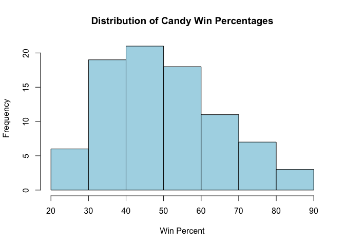<!-- -->

``` r
# ggplot2 version - more customizable
library(ggplot2)
ggplot(candy) +
  aes(x = winpercent) +
  geom_histogram(bins = 30, fill = "lightblue", color = "white") +
  labs(title = "Distribution of Candy Win Percentages",
       x = "Win Percent",
       y = "Count")
```

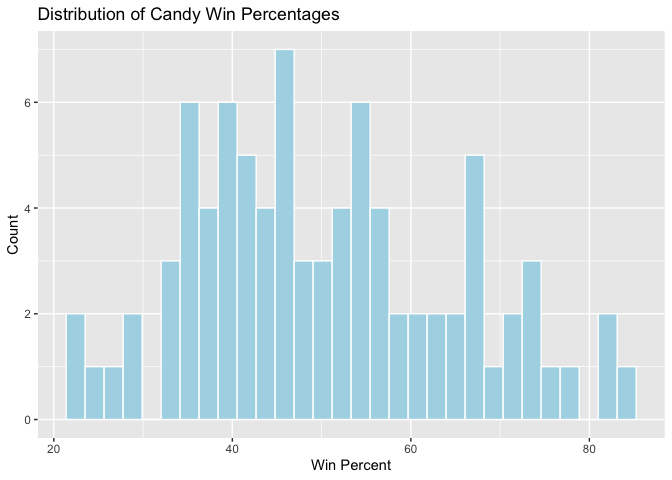<!-- -->

# Q9: The distribution is NOT symmetrical - it is slightly right skewed,

# meaning there are more candies with lower win percentages and a few

# very popular candies pulling the tail to the right

# Q10: The center of the distribution is BELOW 50%, meaning most candies

# lose more matchups than they win - only a few candies are truly beloved

## Q11-Q12. Chocolate vs Fruity - which is more popular?

``` r
# as.logical() converts the 0s and 1s to FALSE/TRUE so we can use them
# as a filter to subset the winpercent values for each candy type

# Average winpercent for chocolate candies
mean(candy$winpercent[as.logical(candy$chocolate)])
```

    ## [1] 60.92153

``` r
# Average winpercent for fruity candies
mean(candy$winpercent[as.logical(candy$fruity)])
```

    ## [1] 44.11974

``` r
# t.test checks whether the difference between these two averages is
# statistically significant or could just be due to random chance
# If p-value < 0.05, the difference is considered statistically significant
t.test(candy$winpercent[as.logical(candy$chocolate)],
       candy$winpercent[as.logical(candy$fruity)])
```

    ## 
    ##  Welch Two Sample t-test
    ## 
    ## data:  candy$winpercent[as.logical(candy$chocolate)] and candy$winpercent[as.logical(candy$fruity)]
    ## t = 6.2582, df = 68.882, p-value = 2.871e-08
    ## alternative hypothesis: true difference in means is not equal to 0
    ## 95 percent confidence interval:
    ##  11.44563 22.15795
    ## sample estimates:
    ## mean of x mean of y 
    ##  60.92153  44.11974

# Q11: Chocolate candy is ranked HIGHER on average than fruity candy

# Chocolate avg ~60% vs fruity avg ~44% - a pretty big gap!

# Q12: YES this difference IS statistically significant

# The p-value is much less than 0.05, meaning this difference is very

# unlikely to be due to random chance. Chocolate really does win more.

## Q13. Five least liked candies

``` r
# arrange() sorts the dataframe, head() takes the first n rows
# Since we want LEAST liked, we sort in ascending order (default)
library(dplyr)
```

    ## 
    ## Attaching package: 'dplyr'

    ## The following objects are masked from 'package:stats':
    ## 
    ##     filter, lag

    ## The following objects are masked from 'package:base':
    ## 
    ##     intersect, setdiff, setequal, union

``` r
candy %>%
  arrange(winpercent) %>%
  head(5)
```

    ##                    chocolate fruity caramel peanutyalmondy nougat
    ## Nik L Nip                  0      1       0              0      0
    ## Boston Baked Beans         0      0       0              1      0
    ## Chiclets                   0      1       0              0      0
    ## Super Bubble               0      1       0              0      0
    ## Jawbusters                 0      1       0              0      0
    ##                    crispedricewafer hard bar pluribus sugarpercent pricepercent
    ## Nik L Nip                         0    0   0        1        0.197        0.976
    ## Boston Baked Beans                0    0   0        1        0.313        0.511
    ## Chiclets                          0    0   0        1        0.046        0.325
    ## Super Bubble                      0    0   0        0        0.162        0.116
    ## Jawbusters                        0    1   0        1        0.093        0.511
    ##                    winpercent
    ## Nik L Nip            22.44534
    ## Boston Baked Beans   23.41782
    ## Chiclets             24.52499
    ## Super Bubble         27.30386
    ## Jawbusters           28.12744

``` r
# Note: these are the candies that lost the most matchups
```

## Q14. Top 5 favorite candies

``` r
# desc() reverses the sort order so highest winpercent comes first
candy %>%
  arrange(desc(winpercent)) %>%
  head(5)
```

    ##                           chocolate fruity caramel peanutyalmondy nougat
    ## Reese's Peanut Butter cup         1      0       0              1      0
    ## Reese's Miniatures                1      0       0              1      0
    ## Twix                              1      0       1              0      0
    ## Kit Kat                           1      0       0              0      0
    ## Snickers                          1      0       1              1      1
    ##                           crispedricewafer hard bar pluribus sugarpercent
    ## Reese's Peanut Butter cup                0    0   0        0        0.720
    ## Reese's Miniatures                       0    0   0        0        0.034
    ## Twix                                     1    0   1        0        0.546
    ## Kit Kat                                  1    0   1        0        0.313
    ## Snickers                                 0    0   1        0        0.546
    ##                           pricepercent winpercent
    ## Reese's Peanut Butter cup        0.651   84.18029
    ## Reese's Miniatures               0.279   81.86626
    ## Twix                             0.906   81.64291
    ## Kit Kat                          0.511   76.76860
    ## Snickers                         0.651   76.67378

``` r
# Note: Reese's dominates the top spots - peanut butter + chocolate is king
```

## Q15. First barplot - rough draft

``` r
# This first plot will be ugly - that's okay! We build plots iteratively,
# starting simple and improving step by step. This is normal in data science.
library(ggplot2)
ggplot(candy) +
  aes(winpercent, rownames(candy)) +
  geom_col()
```

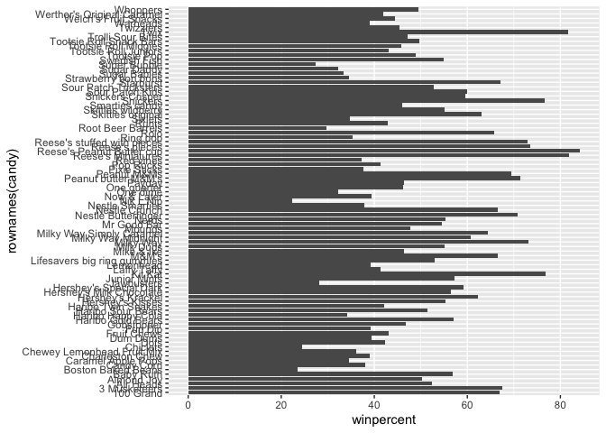<!-- -->

``` r
# Problem: bars are in alphabetical order which makes it hard to compare
```

## Q16. Barplot sorted by winpercent

``` r
# reorder() sorts the y-axis (candy names) by winpercent values
# Now we can actually see which candies are most/least popular at a glance
ggplot(candy) +
  aes(winpercent, reorder(rownames(candy), winpercent)) +
  geom_col()
```

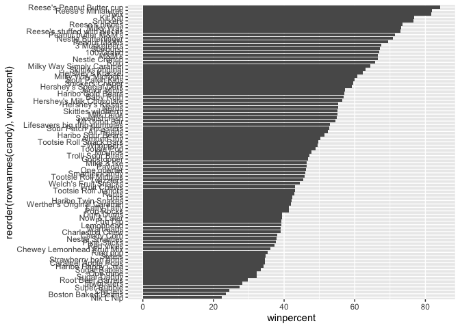<!-- -->

## Adding color to show candy type

``` r
# We create a color vector with one color per candy
# Start with all black, then overwrite with colors for specific types
# This is a clever way to add a categorical color coding without ggplot legends
my_cols <- rep("black", nrow(candy))
my_cols[as.logical(candy$chocolate)] = "chocolate"  # brown-ish
my_cols[as.logical(candy$bar)] = "brown"             # darker brown
my_cols[as.logical(candy$fruity)] = "pink"           # pink for fruity

ggplot(candy) +
  aes(winpercent, reorder(rownames(candy), winpercent)) +
  geom_col(fill = my_cols)
```

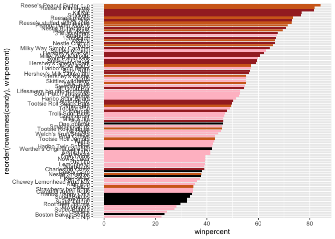<!-- -->

``` r
# Now we can visually see that chocolate candies (brown) cluster at the top
# and fruity candies (pink) tend to be lower ranked
```

# Q17: The worst ranked chocolate candy is Sixlets

# Q18: The best ranked fruity candy is Starburst - go figure, our favorite!

## Q19-Q20. Win percent vs Price percent scatter plot

``` r
# ggrepel automatically moves text labels so they don't overlap each other
# This is super useful when you have many labeled points close together
library(ggrepel)

ggplot(candy) +
  aes(winpercent, pricepercent, label = rownames(candy)) +
  geom_point(col = my_cols) +
  geom_text_repel(col = my_cols, size = 3.3, max.overlaps = 5) +
  labs(title = "Candy Win % vs Price %",
       x = "Win Percent (popularity)",
       y = "Price Percent (cost)")
```

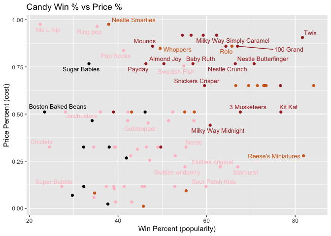<!-- -->

``` r
# We want candies in the TOP LEFT: high win%, low price% = best value
```

# Q19: Reese’s Miniatures offer the most bang for your buck -

# very popular but relatively inexpensive

# Q20: The top 5 most expensive candies are Nik L Nip, Nestle Smarties,

# Ring Pop, Hershey’s Krackel, and Hershey’s Milk Chocolate.

# Nik L Nip is the least popular of these despite being the most expensive!

## Q21. Lollipop chart of pricepercent

``` r
# A lollipop chart is a cleaner alternative to a bar chart
# geom_segment draws the stick, geom_point draws the dot at the end
# Much less visual clutter than filled bars when comparing many items
ggplot(candy) +
  aes(pricepercent, reorder(rownames(candy), pricepercent)) +
  geom_segment(aes(yend = reorder(rownames(candy), pricepercent),
                   xend = 0), col = "gray40") +
  geom_point() +
  labs(title = "Candy Price Rankings",
       x = "Price Percent",
       y = "")
```

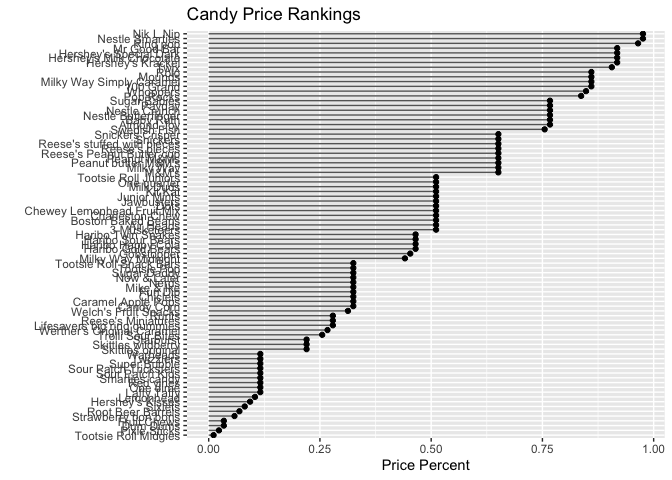<!-- -->

``` r
# Notice how many candies share the same price point - the dots stack up
```

## Q22-Q23. Correlation matrix

``` r
# A correlation matrix shows how every variable relates to every other variable
# Values close to +1 = strong positive correlation
# Values close to -1 = strong negative correlation (anti-correlated)
# Values close to 0 = little to no relationship
# corrplot visualizes this as a colored grid - much easier to read than numbers
library(corrplot)
```

    ## corrplot 0.95 loaded

``` r
cij <- cor(candy)
corrplot(cij)
```

<!-- -->
\# Q22: Chocolate and fruity are the most ANTI-correlated (dark
red/orange) \# This makes intuitive sense - candies are rarely both
chocolatey AND fruity

# Q23: Chocolate and winpercent (and bar and winpercent) are most positively

# correlated - confirming what we saw in our earlier t-test and bar charts

## Q24. Principal Component Analysis (PCA)

``` r
# PCA reduces many variables down to a few "principal components" that
# capture the most important patterns of variation in the data
# scale=TRUE is CRITICAL here because winpercent is on a 0-100 scale
# while everything else is 0-1. Without scaling, winpercent would dominate
# the analysis just because its numbers are bigger, not because it's more important
pca <- prcomp(candy, scale = TRUE)
summary(pca)
```

    ## Importance of components:
    ##                           PC1    PC2    PC3     PC4    PC5     PC6     PC7
    ## Standard deviation     2.0788 1.1378 1.1092 1.07533 0.9518 0.81923 0.81530
    ## Proportion of Variance 0.3601 0.1079 0.1025 0.09636 0.0755 0.05593 0.05539
    ## Cumulative Proportion  0.3601 0.4680 0.5705 0.66688 0.7424 0.79830 0.85369
    ##                            PC8     PC9    PC10    PC11    PC12
    ## Standard deviation     0.74530 0.67824 0.62349 0.43974 0.39760
    ## Proportion of Variance 0.04629 0.03833 0.03239 0.01611 0.01317
    ## Cumulative Proportion  0.89998 0.93832 0.97071 0.98683 1.00000

``` r
# PC1 explains ~36% of variance, PC2 explains ~11% - together they capture
# nearly half of all the variation in the dataset in just 2 dimensions!

# Basic PCA plot
plot(pca$x[,1:2], col = my_cols, pch = 16)
```

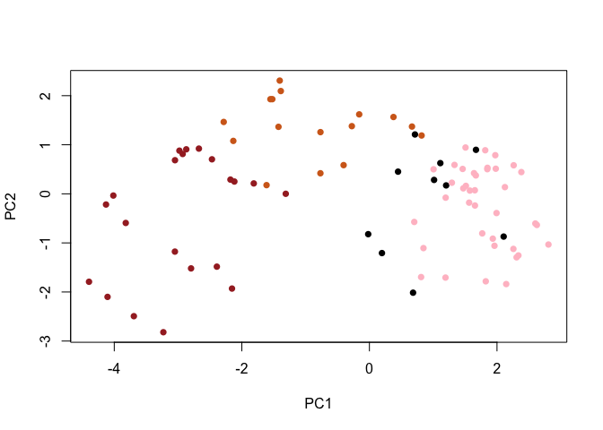<!-- -->

``` r
# We can already see chocolate candies (brown) clustering on the left
# and fruity candies (pink) clustering on the right

# Make a nicer ggplot version
# First we combine our PCA results with the original candy data
my_data <- cbind(candy, pca$x[,1:3])

p <- ggplot(my_data) +
  aes(x = PC1, y = PC2,
      size = winpercent/100,  # bigger points = more popular candy
      text = rownames(my_data),
      label = rownames(my_data)) +
  geom_point(col = my_cols)

p
```

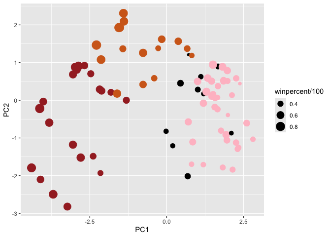<!-- -->

``` r
# Add labels with ggrepel so we can identify each candy
library(ggrepel)
p + geom_text_repel(size = 3.3, col = my_cols, max.overlaps = 7) +
  theme(legend.position = "none") +
  labs(title = "Halloween Candy PCA Space",
       subtitle = "Colored by type: chocolate bar (dark brown), chocolate other (light brown), fruity (pink), other (black)",
       caption = "Data from 538")
```

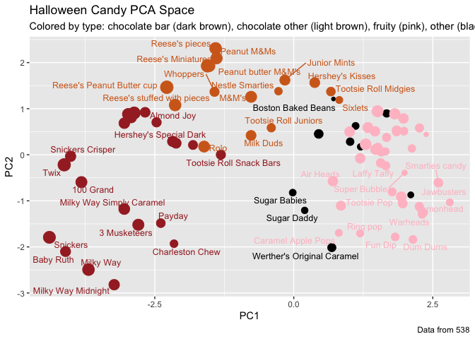<!-- -->

``` r
# Candies that appear close together in this plot are "similar" to each other
# based on all their combined properties

# Loadings plot - shows which original variables drive each PC
# This tells us WHAT makes candies different from each other along each axis
ggplot(pca$rotation) +
  aes(PC1, PC2) +
  geom_label(label = rownames(pca$rotation)) +
  labs(title = "PCA Loadings",
       x = "PC1 loadings",
       y = "PC2 loadings")
```

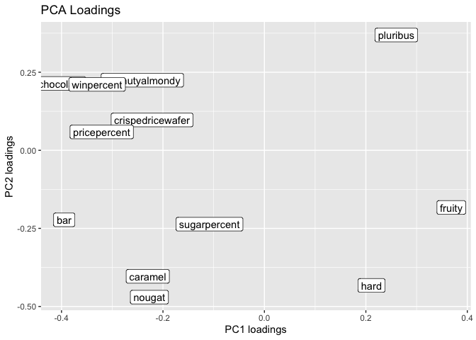<!-- -->
\# Q24: Fruity, hard, and pluribus are picked up strongly by PC1 in the
\# POSITIVE direction. This makes sense - fruity candies tend to be hard
\# and come in bags with multiple pieces (pluribus). Chocolate, bar, and
\# winpercent load strongly in the NEGATIVE PC1 direction, meaning
chocolate \# bar candies are on the opposite end of the spectrum from
fruity hard candies. \# We saw this exact relationship highlighted in
the correlation matrix earlier!

## Q25. Summary - what makes a winning candy?

# Based on all three analyses:

# VISUALIZATION: The colored barplot clearly showed chocolate candies

# dominating the top of the rankings

# 

# CORRELATION: The correlation matrix confirmed chocolate and winpercent

# are strongly positively correlated, while fruity and winpercent are not

# 

# PCA: The PCA score plot showed that the most popular candies (largest points)

# cluster on the negative PC1 side, which the loadings plot tells us corresponds

# to chocolate, bar, and caramel characteristics

# 

# CONCLUSION: A winning candy is most likely to be a chocolate candy bar

# with additional components like caramel, peanuts/almonds, or crisped rice.

# Think Reese’s, Twix, Kit Kat, Snickers - the classics dominate for a reason!

## Q26. Are popular candies more expensive?

``` r
losers <- candy[which(candy$winpercent < 50),]
winners <- candy[which(candy$winpercent >= 50),]

mean(winners$pricepercent)
```

    ## [1] 0.580359

``` r
mean(losers$pricepercent)
```

    ## [1] 0.3743696

``` r
# t.test to check if the price difference is statistically significant
t.test(winners$pricepercent, losers$pricepercent)
```

    ## 
    ##  Welch Two Sample t-test
    ## 
    ## data:  winners$pricepercent and losers$pricepercent
    ## t = 3.5653, df = 82.798, p-value = 0.0006068
    ## alternative hypothesis: true difference in means is not equal to 0
    ## 95 percent confidence interval:
    ##  0.09107157 0.32090727
    ## sample estimates:
    ## mean of x mean of y 
    ## 0.5803590 0.3743696

# Winners have a higher average price (0.580) vs losers (0.374)

# The p-value is 0.0006, which is well below 0.05, so this difference

# IS statistically significant. Popular candies DO tend to cost more -

# if you want the good stuff, you have to pay for it!

## Q27. Are candies with more sugar more popular?

``` r
mean(winners$sugarpercent)
```

    ## [1] 0.5343077

``` r
mean(losers$sugarpercent)
```

    ## [1] 0.4314565

``` r
t.test(winners$sugarpercent, losers$sugarpercent)
```

    ## 
    ##  Welch Two Sample t-test
    ## 
    ## data:  winners$sugarpercent and losers$sugarpercent
    ## t = 1.6958, df = 81.799, p-value = 0.09373
    ## alternative hypothesis: true difference in means is not equal to 0
    ## 95 percent confidence interval:
    ##  -0.01780701  0.22350935
    ## sample estimates:
    ## mean of x mean of y 
    ## 0.5343077 0.4314565

## Winners have slightly higher sugar content (0.534) vs losers (0.431)

# But the p-value is 0.094, above 0.05, so NOT statistically significant

# Interesting! Sugar content alone does NOT drive candy popularity.

# It’s really about the chocolate, not the sugar. Quality over quantity!
