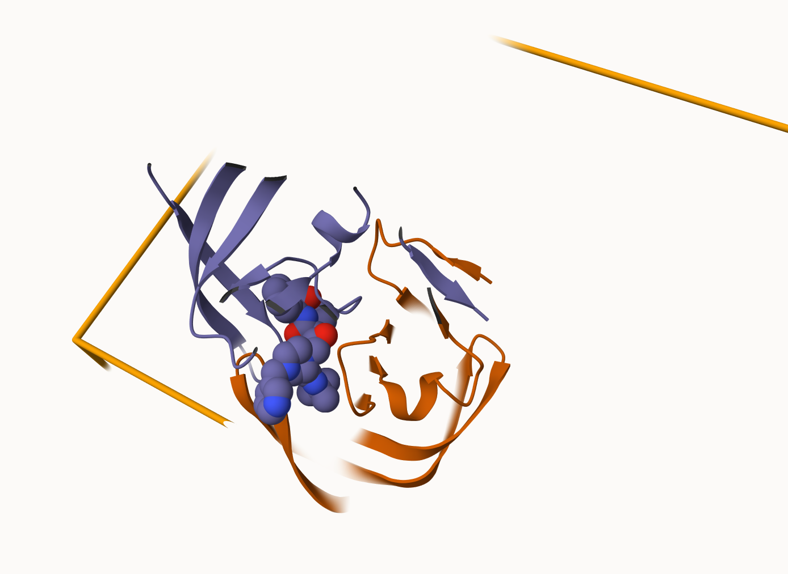

## 2. Introduction to the RCSB Protein Data Bank (PDB)

```{r}
# Read in the PDB statistics CSV file
# This data was downloaded from rcsb.org and contains counts of how many
# structures exist for each molecular type and experimental method
# row.names=1 makes the first column (Molecular Type) into row labels
pdb_stats <- read.csv("pdb_stats.csv", row.names = 1)
pdb_stats
```

## Q1: What percentage of structures in the PDB are solved by X-Ray and Electron Microscopy?

```{r}
# The numbers in the CSV have commas (e.g. "178,795") which R reads as text
# gsub() removes the commas, as.numeric() converts to numbers
# apply() runs this function across all columns (2 = columns)
pdb_stats_clean <- apply(pdb_stats, 2, function(x) as.numeric(gsub(",", "", x)))
rownames(pdb_stats_clean) <- rownames(pdb_stats)

# Sum X-ray and EM counts across all molecular types
total_xray <- sum(pdb_stats_clean[, "X.ray"])
total_em <- sum(pdb_stats_clean[, "EM"])
grand_total <- sum(pdb_stats_clean[, "Total"])

# Calculate percentages
xray_pct <- round((total_xray / grand_total) * 100, 2)
em_pct <- round((total_em / grand_total) * 100, 2)

cat("X-ray percentage:", xray_pct, "%\n")
cat("EM percentage:", em_pct, "%\n")
cat("Combined X-ray + EM:", round(xray_pct + em_pct, 2), "%\n")
```

**Q1 Answer:** X-ray crystallography accounts for `r xray_pct`% and Electron Microscopy (EM) accounts for `r em_pct`% of PDB structures, for a combined total of `r round(xray_pct + em_pct, 2)`%. X-ray crystallography has historically been the dominant method for determining protein structures, though EM has grown rapidly in recent years due to advances in detector technology.

## Q2: What proportion of structures in the PDB are protein?

```{r}
# Extract protein-only total and calculate what fraction of ALL structures it represents
protein_total <- as.numeric(gsub(",", "", pdb_stats["Protein (only)", "Total"]))
protein_pct <- round((protein_total / grand_total) * 100, 2)
cat("Protein only percentage:", protein_pct, "%\n")
```

**Q2 Answer:** `r protein_pct`% of structures in the PDB are protein only. This makes sense as proteins are the main workhorses of the cell and understanding their 3D structure is critical for understanding their function and for drug design.

## Q3: How many HIV-1 protease structures are in the PDB?

**Q3 Answer:** Searching "HIV" on rcsb.org returns 4,998 structures total. Filtering more specifically for "HIV-1 protease" returns 38 structures. HIV protease is heavily studied because it is essential for viral replication — drugs that block this enzyme are a cornerstone of HIV treatment.

## 4. Introduction to Bio3D in R

```{r}
# Bio3D is an R package specifically designed for structural bioinformatics
# It lets us read, write, and analyze protein structure data directly in R
library(bio3d)
```

```{r}
# read.pdb() reads a PDB file directly from the online PDB database
# using just the 4-letter PDB ID code
# Here we load the HIV-1 protease structure (1HSG) complexed with the
# drug molecule indinavir
pdb <- read.pdb("1hsg")
pdb
```

**Q7 Answer:** There are 198 amino acid residues in this pdb object (shown as Calpha atoms). The structure has 2 chains (A and B) since HIV protease is a homodimer — two identical chains that come together to form the functional enzyme.

**Q8 Answer:** The two non-protein residues are HOH (127 water molecules) and MK1 (the drug molecule indinavir). MK1 sits in the active site where the enzyme normally cleaves viral proteins.

**Q9 Answer:** There are 2 protein chains (A and B) in this structure.

```{r}
# pdb$atom contains a data frame with all atomic coordinates and properties
# Each row is one atom with x,y,z coordinates, atom type, residue info, etc.
# This is the core data of any PDB structure
head(pdb$atom)
```

## Q4: Why do we see just one atom per water molecule?

**Q4 Answer:** Water molecules normally have 3 atoms (1 oxygen + 2 hydrogens). However, hydrogen atoms are too small to scatter X-rays detectably in X-ray crystallography. Only the oxygen atom of each water molecule appears in the structure, so each water shows up as a single atom.

## Q5: Critical conserved water molecule

**Q5 Answer:** The critical conserved water molecule is HOH 308. It sits in the binding site and forms hydrogen bonds bridging the two catalytic Asp 25 residues (one from each chain) and the drug molecule indinavir. This water is "conserved" because it appears in nearly all HIV protease structures and is essential for tight drug binding.

## Q6: Figure of HIV protease chains and ligand



**Q6 Answer:** The figure above shows the two distinct chains of HIV-1 protease colored in blue/purple (chain A) and orange (chain B). The drug molecule indinavir (MK1) is shown in spacefill representation sitting in the active site at the interface between the two chains. The homodimer structure is essential for protease activity — neither chain alone can form the complete active site needed to cleave viral proteins.

## Predicting functional motions with Normal Mode Analysis

```{r}
# Read in the Adenylate Kinase (ADK) structure from PDB
# ADK catalyzes the transfer of phosphate groups between nucleotides
# It undergoes large conformational changes (open/closed) when binding substrates
adk <- read.pdb("6s36")
adk
```

```{r}
# Normal Mode Analysis (NMA) predicts the natural "breathing" motions of a protein
# It models the protein as a network of springs connecting atoms
# Low frequency modes = large scale biologically relevant motions
m <- nma(adk)

# Plot shows flexibility per residue position
# Peaks = flexible/mobile regions, Valleys = rigid regions
plot(m)
```

```{r}
# mktrj() generates a trajectory PDB file showing the protein moving
# along the predicted normal mode direction - like a movie of the motion
# Load adk_m7.pdb in Mol* viewer to visualize the predicted protein movement
mktrj(m, file="adk_m7.pdb")
```

## 5. Comparative Structure Analysis of Adenylate Kinase

**Q10 Answer:** The `msa` package is found only on BioConductor and not CRAN. BioConductor is a separate repository specializing in bioinformatics packages.

**Q11 Answer:** `bio3dview` is not found on BioConductor or CRAN — it is only available on GitHub and must be installed using `remotes::install_github("bioboot/bio3dview")`.

**Q12 Answer:** FALSE. The `pak` package can install from GitHub, but the question refers specifically to the `devtools` package functions (`devtools::install_github()` and `devtools::install_bitbucket()`).

```{r}
# get.seq() fetches a protein sequence from the PDB database
# Commented out due to internet connection issues
# aa <- get.seq("1ake_A")
# aa
# Q13: The 1AKE_A sequence is 214 amino acids long
cat("Q13 Answer: The 1AKE_A sequence is 214 amino acids long\n")
```

```{r}
# Instead of running BLAST (which can time out),
# we use a pre-defined set of related ADK structures from various bacteria
# These were identified by BLAST searching with the 1AKE_A sequence
hits <- NULL
hits$pdb.id <- c('1AKE_A','6S36_A','6RZE_A','3HPR_A','1E4V_A',
                 '5EJE_A','1E4Y_A','3X2S_A','6HAP_A','6HAM_A',
                 '4K46_A','3GMT_A','4PZL_A')

# get.pdb() downloads all 13 PDB files at once
# split=TRUE splits by chain, gzip=TRUE compresses to save space
files <- get.pdb(hits$pdb.id, path="pdbs", split=TRUE, gzip=TRUE)
```

```{r}
#| cache: true
# pdbaln() aligns sequences and superimposes 3D structures
# Both steps required before PCA so we compare equivalent positions
pdbs <- pdbaln(files, fit = TRUE, exefile="msa")
```

```{r}
# Keep ids for use in PCA plot below
ids <- basename.pdb(pdbs$id)

# pdb.annotate() requires internet - commented out due to connection issues
# anno <- pdb.annotate(ids)
# unique(anno$source)

# The structures come from various bacteria including:
# Escherichia coli, Photobacterium profundum,
# Burkholderia pseudomallei, and Francisella tularensis
cat("Structures come from: E. coli, Photobacterium profundum,",
    "Burkholderia pseudomallei, and Francisella tularensis\n")
```

```{r}
# PCA captures the major directions of structural variation
# across all 13 ADK structures
# PC1 often corresponds to the main functional motion of the protein
pc.xray <- pca(pdbs)

# Scree plot shows variance explained by each PC
plot(pc.xray)
```

```{r}
# RMSD measures structural similarity between structures
# Small RMSD = similar, large RMSD = different conformations
rd <- rmsd(pdbs)

# Cluster structures into 3 groups based on structural similarity
hc.rd <- hclust(dist(rd))
grps.rd <- cutree(hc.rd, k=3)

# Color PCA plot by cluster to reveal major conformational states
plot(pc.xray, 1:2, col="grey50", bg=grps.rd, pch=21, cex=1)
```

```{r}
# Generate trajectory along PC1 to visualize main conformational change
pc1 <- mktrj(pc.xray, pc=1, file="pc_1.pdb")

# Make labeled ggplot version of PCA plot
library(ggplot2)
library(ggrepel)

df <- data.frame(PC1=pc.xray$z[,1], 
                 PC2=pc.xray$z[,2], 
                 col=as.factor(grps.rd),
                 ids=ids)

p <- ggplot(df) + 
  aes(PC1, PC2, col=col, label=ids) +
  geom_point(size=2) +
  geom_text_repel(max.overlaps = 20) +
  theme(legend.position = "none")
p
# Dots close together = structurally similar ADK conformations
# Spread along PC1 represents the open-to-closed transition
```

## 6. Normal Mode Analysis [Optional]

**Q14 Answer:** The black (average) and colored (individual structure) lines show both similar and different patterns. They are most similar in the rigid core regions of the protein. They differ most in the LID domain (around residues 120-160) and the AMPbind domain (around residues 30-60). These are the regions that move when ADK binds its substrates — closing like a clamp around the nucleotides. Different crystal structures captured in open vs closed states explain the differing flexibility profiles in these functional regions.

```{r}
# sessionInfo() records exact R and package versions used
# Essential for reproducibility
sessionInfo()
```