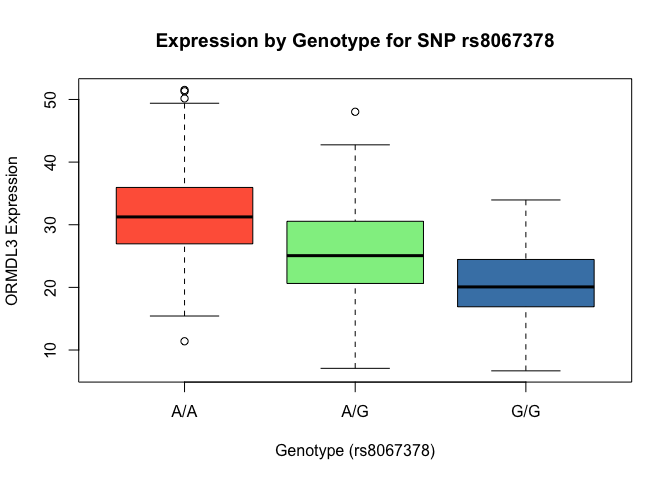

Lab 12 Section 4: Population Scale Analysis
================
Omar Siddiqui
11 May 2026

## Q13

``` r
# Read the data
expr <- read.table("rs8067378_ENSG00000172057.6.txt", header = TRUE)

# Sample size for each genotype
table(expr$geno)
```

    ## 
    ## A/A A/G G/G 
    ## 108 233 121

``` r
# Median expression for each genotype
tapply(expr$exp, expr$geno, median)
```

    ##      A/A      A/G      G/G 
    ## 31.24847 25.06486 20.07363

The sample sizes are: A/A (n=108), A/G (n=233), and G/G (n=121). The
corresponding median expression levels are: A/A = 31.25, A/G = 25.07,
and G/G = 20.07. There is a clear decrease in median expression with
each additional copy of the G allele.

## Q14

``` r
# Boxplot of expression by genotype
boxplot(exp ~ geno, data = expr,
        xlab = "Genotype (rs8067378)",
        ylab = "ORMDL3 Expression",
        main = "Expression by Genotype for SNP rs8067378",
        col = c("tomato", "lightgreen", "steelblue"))
```

<!-- -->

From the boxplot, A/A individuals have the highest ORMDL3 expression,
A/G is intermediate, and G/G has the lowest. This indicates that the SNP
rs8067378 does affect ORMDL3 expression — each copy of the G allele is
associated with roughly 5-6 units lower expression. The asthma-risk G
allele therefore appears to reduce ORMDL3 transcription in an additive
manner.
