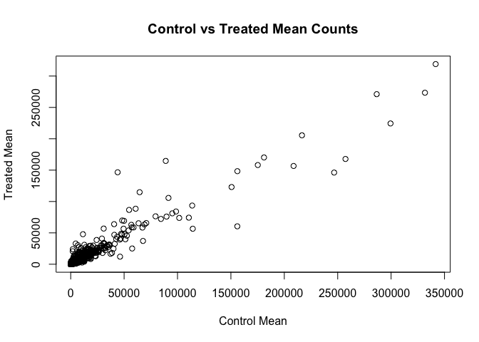
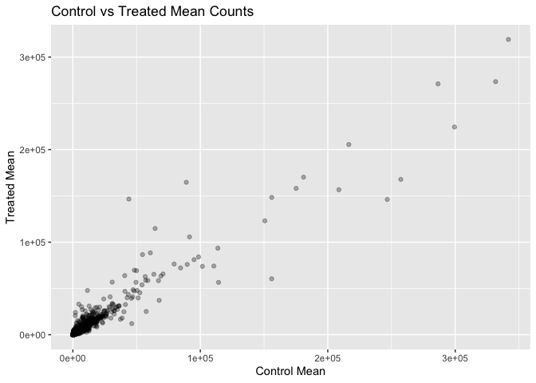
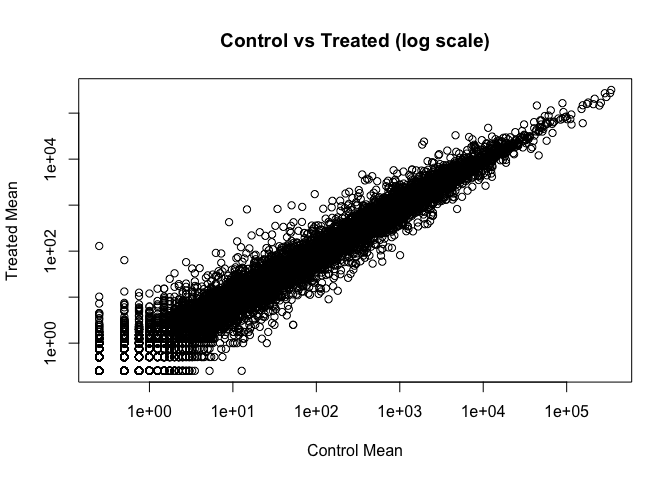
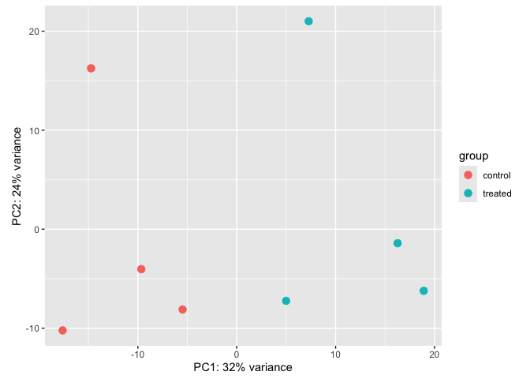
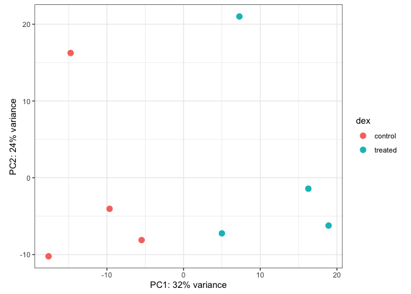
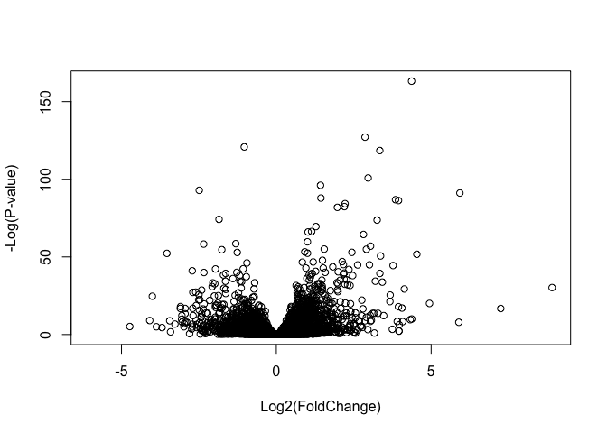
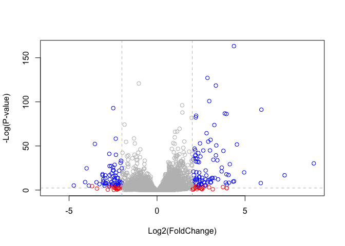

# Class 13: Transcriptomics and RNA-Seq Analysis
Your Name

## Setup

``` r
library(DESeq2)
library(ggplot2)
library(dplyr)
library(AnnotationDbi)
library(org.Hs.eg.db)
```

## Import Data

``` r
counts <- read.csv("airway_scaledcounts.csv", row.names=1)
metadata <- read.csv("airway_metadata.csv")
head(counts)
```

                    SRR1039508 SRR1039509 SRR1039512 SRR1039513 SRR1039516
    ENSG00000000003        723        486        904        445       1170
    ENSG00000000005          0          0          0          0          0
    ENSG00000000419        467        523        616        371        582
    ENSG00000000457        347        258        364        237        318
    ENSG00000000460         96         81         73         66        118
    ENSG00000000938          0          0          1          0          2
                    SRR1039517 SRR1039520 SRR1039521
    ENSG00000000003       1097        806        604
    ENSG00000000005          0          0          0
    ENSG00000000419        781        417        509
    ENSG00000000457        447        330        324
    ENSG00000000460         94        102         74
    ENSG00000000938          0          0          0

``` r
head(metadata)
```

              id     dex celltype     geo_id
    1 SRR1039508 control   N61311 GSM1275862
    2 SRR1039509 treated   N61311 GSM1275863
    3 SRR1039512 control  N052611 GSM1275866
    4 SRR1039513 treated  N052611 GSM1275867
    5 SRR1039516 control  N080611 GSM1275870
    6 SRR1039517 treated  N080611 GSM1275871

## Q1. How many genes are in this dataset?

``` r
nrow(counts)
```

    [1] 38694

There are 38694 genes in this dataset.

## Q2. How many ‘control’ cell lines do we have?

``` r
sum(metadata$dex == "control")
```

    [1] 4

There are 4 control cell lines.

## Toy Differential Gene Expression

``` r
control <- metadata[metadata[,"dex"]=="control",]
control.counts <- counts[, control$id]
control.mean <- rowSums(control.counts) / nrow(control)
head(control.mean)
```

    ENSG00000000003 ENSG00000000005 ENSG00000000419 ENSG00000000457 ENSG00000000460 
             900.75            0.00          520.50          339.75           97.25 
    ENSG00000000938 
               0.75 

## Q3. How would you make the above code more robust?

``` r
control <- metadata[metadata[,"dex"]=="control",]
control.counts <- counts[, control$id]
control.mean <- rowSums(control.counts) / nrow(control)
head(control.mean)
```

    ENSG00000000003 ENSG00000000005 ENSG00000000419 ENSG00000000457 ENSG00000000460 
             900.75            0.00          520.50          339.75           97.25 
    ENSG00000000938 
               0.75 

Instead of hardcoding `/4` we use `nrow(control)` to automatically count
the number of control samples. This makes the code more robust if the
number of samples changes.

## Q4. Calculate the mean per gene for treated samples

``` r
treated <- metadata[metadata[,"dex"]=="treated",]
treated.counts <- counts[, treated$id]
treated.mean <- rowSums(treated.counts) / nrow(treated)
head(treated.mean)
```

    ENSG00000000003 ENSG00000000005 ENSG00000000419 ENSG00000000457 ENSG00000000460 
             658.00            0.00          546.00          316.50           78.75 
    ENSG00000000938 
               0.00 

## Q5. Scatter plot of control vs treated means

``` r
meancounts <- data.frame(control.mean, treated.mean)

plot(meancounts[,1], meancounts[,2],
     xlab="Control Mean",
     ylab="Treated Mean",
     main="Control vs Treated Mean Counts")
```



``` r
ggplot(meancounts, aes(x=control.mean, y=treated.mean)) +
  geom_point(alpha=0.3) +
  xlab("Control Mean") +
  ylab("Treated Mean") +
  ggtitle("Control vs Treated Mean Counts")
```



For Q5b I would use `geom_point()` for this scatter plot.

## Q6. Plot both axes on a log scale

``` r
plot(meancounts[,1], meancounts[,2],
     xlab="Control Mean",
     ylab="Treated Mean",
     log="xy",
     main="Control vs Treated (log scale)")
```



The argument `log="xy"` in the base R `plot()` function sets both axes
to log scale. Using log scale reveals the spread of lowly expressed
genes that were all clustered near the origin in the original plot.

## Log2 Fold Change

``` r
meancounts$log2fc <- log2(meancounts[,"treated.mean"]/meancounts[,"control.mean"])
head(meancounts)
```

                    control.mean treated.mean      log2fc
    ENSG00000000003       900.75       658.00 -0.45303916
    ENSG00000000005         0.00         0.00         NaN
    ENSG00000000419       520.50       546.00  0.06900279
    ENSG00000000457       339.75       316.50 -0.10226805
    ENSG00000000460        97.25        78.75 -0.30441833
    ENSG00000000938         0.75         0.00        -Inf

## Q7. Purpose of arr.ind argument in which()

``` r
zero.vals <- which(meancounts[,1:2]==0, arr.ind=TRUE)
to.rm <- unique(zero.vals[,1])
mycounts <- meancounts[-to.rm,]
head(mycounts)
```

                    control.mean treated.mean      log2fc
    ENSG00000000003       900.75       658.00 -0.45303916
    ENSG00000000419       520.50       546.00  0.06900279
    ENSG00000000457       339.75       316.50 -0.10226805
    ENSG00000000460        97.25        78.75 -0.30441833
    ENSG00000000971      5219.00      6687.50  0.35769358
    ENSG00000001036      2327.00      1785.75 -0.38194109

The `arr.ind=TRUE` argument causes `which()` to return both the row AND
column indices of TRUE values, rather than just a single element
position number. This is important because we are checking a 2-column
data frame for zeros and need to know which rows contain zeros. We take
the first column (row indices) and call `unique()` to avoid trying to
remove the same row twice in case a gene has zeros in both the control
and treated columns.

## Q8. How many up-regulated genes at log2FC \> 2?

``` r
up.ind <- mycounts$log2fc > 2
sum(up.ind)
```

    [1] 250

There are 250 up-regulated genes at a log2 fold change greater than 2.

## Q9. How many down-regulated genes at log2FC \< -2?

``` r
down.ind <- mycounts$log2fc < (-2)
sum(down.ind)
```

    [1] 367

There are 367 down-regulated genes at a log2 fold change less than -2.

## Q10. Do you trust these results?

No, these results should not be fully trusted. While we can see large
fold changes, we have not performed any statistical testing to determine
whether these differences are significant. We have no p-values or
adjusted p-values, and we have not accounted for variability between
replicates. A proper differential expression analysis using DESeq2 is
needed.

## Setting Up DESeq2

``` r
dds <- DESeqDataSetFromMatrix(countData=counts,
                              colData=metadata,
                              design=~dex)
dds
```

    class: DESeqDataSet 
    dim: 38694 8 
    metadata(1): version
    assays(1): counts
    rownames(38694): ENSG00000000003 ENSG00000000005 ... ENSG00000283120
      ENSG00000283123
    rowData names(0):
    colnames(8): SRR1039508 SRR1039509 ... SRR1039520 SRR1039521
    colData names(4): id dex celltype geo_id

## Principal Component Analysis (PCA)

``` r
vsd <- vst(dds, blind=FALSE)
plotPCA(vsd, intgroup=c("dex"))
```



``` r
pcaData <- plotPCA(vsd, intgroup=c("dex"), returnData=TRUE)
percentVar <- round(100 * attr(pcaData, "percentVar"))

ggplot(pcaData) +
  aes(x=PC1, y=PC2, color=dex) +
  geom_point(size=3) +
  xlab(paste0("PC1: ", percentVar[1], "% variance")) +
  ylab(paste0("PC2: ", percentVar[2], "% variance")) +
  coord_fixed() +
  theme_bw()
```



## DESeq Analysis

``` r
dds <- DESeq(dds)
res <- results(dds)
res
```

    log2 fold change (MLE): dex treated vs control 
    Wald test p-value: dex treated vs control 
    DataFrame with 38694 rows and 6 columns
                     baseMean log2FoldChange     lfcSE      stat    pvalue
                    <numeric>      <numeric> <numeric> <numeric> <numeric>
    ENSG00000000003  747.1942      -0.350703  0.168242 -2.084514 0.0371134
    ENSG00000000005    0.0000             NA        NA        NA        NA
    ENSG00000000419  520.1342       0.206107  0.101042  2.039828 0.0413675
    ENSG00000000457  322.6648       0.024527  0.145134  0.168996 0.8658000
    ENSG00000000460   87.6826      -0.147143  0.256995 -0.572550 0.5669497
    ...                   ...            ...       ...       ...       ...
    ENSG00000283115  0.000000             NA        NA        NA        NA
    ENSG00000283116  0.000000             NA        NA        NA        NA
    ENSG00000283119  0.000000             NA        NA        NA        NA
    ENSG00000283120  0.974916       -0.66825   1.69441 -0.394385  0.693297
    ENSG00000283123  0.000000             NA        NA        NA        NA
                         padj
                    <numeric>
    ENSG00000000003  0.163017
    ENSG00000000005        NA
    ENSG00000000419  0.175937
    ENSG00000000457  0.961682
    ENSG00000000460  0.815805
    ...                   ...
    ENSG00000283115        NA
    ENSG00000283116        NA
    ENSG00000283119        NA
    ENSG00000283120        NA
    ENSG00000283123        NA

``` r
summary(res)
```


    out of 25258 with nonzero total read count
    adjusted p-value < 0.1
    LFC > 0 (up)       : 1564, 6.2%
    LFC < 0 (down)     : 1188, 4.7%
    outliers [1]       : 142, 0.56%
    low counts [2]     : 9971, 39%
    (mean count < 10)
    [1] see 'cooksCutoff' argument of ?results
    [2] see 'independentFiltering' argument of ?results

``` r
res05 <- results(dds, alpha=0.05)
summary(res05)
```


    out of 25258 with nonzero total read count
    adjusted p-value < 0.05
    LFC > 0 (up)       : 1237, 4.9%
    LFC < 0 (down)     : 933, 3.7%
    outliers [1]       : 142, 0.56%
    low counts [2]     : 9033, 36%
    (mean count < 6)
    [1] see 'cooksCutoff' argument of ?results
    [2] see 'independentFiltering' argument of ?results

## Q11. Adding Annotation Data

``` r
res$symbol <- mapIds(org.Hs.eg.db,
                     keys=row.names(res),
                     keytype="ENSEMBL",
                     column="SYMBOL",
                     multiVals="first")

res$entrez <- mapIds(org.Hs.eg.db,
                     keys=row.names(res),
                     keytype="ENSEMBL",
                     column="ENTREZID",
                     multiVals="first")

res$uniprot <- mapIds(org.Hs.eg.db,
                      keys=row.names(res),
                      keytype="ENSEMBL",
                      column="UNIPROT",
                      multiVals="first")

res$genename <- mapIds(org.Hs.eg.db,
                       keys=row.names(res),
                       keytype="ENSEMBL",
                       column="GENENAME",
                       multiVals="first")

head(res)
```

    log2 fold change (MLE): dex treated vs control 
    Wald test p-value: dex treated vs control 
    DataFrame with 6 rows and 10 columns
                      baseMean log2FoldChange     lfcSE      stat    pvalue
                     <numeric>      <numeric> <numeric> <numeric> <numeric>
    ENSG00000000003 747.194195      -0.350703  0.168242 -2.084514 0.0371134
    ENSG00000000005   0.000000             NA        NA        NA        NA
    ENSG00000000419 520.134160       0.206107  0.101042  2.039828 0.0413675
    ENSG00000000457 322.664844       0.024527  0.145134  0.168996 0.8658000
    ENSG00000000460  87.682625      -0.147143  0.256995 -0.572550 0.5669497
    ENSG00000000938   0.319167      -1.732289  3.493601 -0.495846 0.6200029
                         padj      symbol      entrez     uniprot
                    <numeric> <character> <character> <character>
    ENSG00000000003  0.163017      TSPAN6        7105  A0A087WYV6
    ENSG00000000005        NA        TNMD       64102      Q9H2S6
    ENSG00000000419  0.175937        DPM1        8813      H0Y368
    ENSG00000000457  0.961682       SCYL3       57147      X6RHX1
    ENSG00000000460  0.815805       FIRRM       55732      A6NFP1
    ENSG00000000938        NA         FGR        2268      B7Z6W7
                                  genename
                               <character>
    ENSG00000000003          tetraspanin 6
    ENSG00000000005            tenomodulin
    ENSG00000000419 dolichyl-phosphate m..
    ENSG00000000457 SCY1 like pseudokina..
    ENSG00000000460 FIGNL1 interacting r..
    ENSG00000000938 FGR proto-oncogene, ..

``` r
ord <- order(res$padj)
head(res[ord,])
```

    log2 fold change (MLE): dex treated vs control 
    Wald test p-value: dex treated vs control 
    DataFrame with 6 rows and 10 columns
                     baseMean log2FoldChange     lfcSE      stat      pvalue
                    <numeric>      <numeric> <numeric> <numeric>   <numeric>
    ENSG00000152583   954.771        4.36836 0.2371306   18.4217 8.79214e-76
    ENSG00000179094   743.253        2.86389 0.1755659   16.3123 8.06568e-60
    ENSG00000116584  2277.913       -1.03470 0.0650826  -15.8983 6.51317e-57
    ENSG00000189221  2383.754        3.34154 0.2124091   15.7316 9.17960e-56
    ENSG00000120129  3440.704        2.96521 0.2036978   14.5569 5.27883e-48
    ENSG00000148175 13493.920        1.42717 0.1003811   14.2175 7.13625e-46
                           padj      symbol      entrez     uniprot
                      <numeric> <character> <character> <character>
    ENSG00000152583 1.33157e-71     SPARCL1        8404      B4E2Z0
    ENSG00000179094 6.10774e-56        PER1        5187      A2I2P6
    ENSG00000116584 3.28806e-53     ARHGEF2        9181  A0A8Q3SIN5
    ENSG00000189221 3.47563e-52        MAOA        4128      B4DF46
    ENSG00000120129 1.59896e-44       DUSP1        1843      B4DRR4
    ENSG00000148175 1.80131e-42        STOM        2040      F8VSL7
                                  genename
                               <character>
    ENSG00000152583           SPARC like 1
    ENSG00000179094 period circadian reg..
    ENSG00000116584 Rho/Rac guanine nucl..
    ENSG00000189221    monoamine oxidase A
    ENSG00000120129 dual specificity pho..
    ENSG00000148175               stomatin

``` r
write.csv(res[ord,], "deseq_results.csv")
```

## Volcano Plots

``` r
plot(res$log2FoldChange, -log(res$padj),
     xlab="Log2(FoldChange)",
     ylab="-Log(P-value)")
```



``` r
plot(res$log2FoldChange, -log(res$padj),
     ylab="-Log(P-value)", xlab="Log2(FoldChange)")
abline(v=c(-2,2), col="darkgray", lty=2)
abline(h=-log(0.05), col="darkgray", lty=2)
```


``` r
mycols <- rep("gray", nrow(res))
mycols[ abs(res$log2FoldChange) > 2 ] <- "red"
inds <- (res$padj < 0.01) & (abs(res$log2FoldChange) > 2)
mycols[ inds ] <- "blue"

plot(res$log2FoldChange, -log(res$padj),
     col=mycols, ylab="-Log(P-value)", xlab="Log2(FoldChange)")
abline(v=c(-2,2), col="gray", lty=2)
abline(h=-log(0.1), col="gray", lty=2)
```



## Q12. Pathway Analysis - Top 2 Down-regulated Pathways

``` r
library(pathview)
library(gage)
library(gageData)

data(kegg.sets.hs)

foldchanges <- res$log2FoldChange
names(foldchanges) <- res$entrez

keggres <- gage(foldchanges, gsets=kegg.sets.hs)
head(keggres$less, 3)
```

                                          p.geomean stat.mean        p.val
    hsa05332 Graft-versus-host disease 0.0004250607 -3.473335 0.0004250607
    hsa04940 Type I diabetes mellitus  0.0017820379 -3.002350 0.0017820379
    hsa05310 Asthma                    0.0020046180 -3.009045 0.0020046180
                                            q.val set.size         exp1
    hsa05332 Graft-versus-host disease 0.09053792       40 0.0004250607
    hsa04940 Type I diabetes mellitus  0.14232788       42 0.0017820379
    hsa05310 Asthma                    0.14232788       29 0.0020046180

``` r
pathview(gene.data=foldchanges, pathway.id="hsa05332")
```

``` r
pathview(gene.data=foldchanges, pathway.id="hsa04940")
```

The top 2 down-regulated KEGG pathways are Graft-versus-host disease
(hsa05332) and Type I diabetes mellitus (hsa04940). Both are
immune-related pathways, consistent with the known anti-inflammatory
effects of dexamethasone.

## Session Information

``` r
sessionInfo()
```

    R version 4.5.3 (2026-03-11)
    Platform: aarch64-apple-darwin20
    Running under: macOS Tahoe 26.5.1

    Matrix products: default
    BLAS:   /Library/Frameworks/R.framework/Versions/4.5-arm64/Resources/lib/libRblas.0.dylib 
    LAPACK: /Library/Frameworks/R.framework/Versions/4.5-arm64/Resources/lib/libRlapack.dylib;  LAPACK version 3.12.1

    locale:
    [1] en_US.UTF-8/en_US.UTF-8/en_US.UTF-8/C/en_US.UTF-8/en_US.UTF-8

    time zone: America/Los_Angeles
    tzcode source: internal

    attached base packages:
    [1] stats4    stats     graphics  grDevices utils     datasets  methods  
    [8] base     

    other attached packages:
     [1] gageData_2.48.0             gage_2.60.0                
     [3] pathview_1.50.0             org.Hs.eg.db_3.22.0        
     [5] AnnotationDbi_1.72.0        dplyr_1.2.1                
     [7] ggplot2_4.0.3               DESeq2_1.50.2              
     [9] SummarizedExperiment_1.40.0 Biobase_2.70.0             
    [11] MatrixGenerics_1.22.0       matrixStats_1.5.0          
    [13] GenomicRanges_1.62.1        Seqinfo_1.0.0              
    [15] IRanges_2.44.0              S4Vectors_0.48.1           
    [17] BiocGenerics_0.56.0         generics_0.1.4             

    loaded via a namespace (and not attached):
     [1] KEGGREST_1.50.0     gtable_0.3.6        xfun_0.57          
     [4] lattice_0.22-9      bitops_1.0-9        vctrs_0.7.3        
     [7] tools_4.5.3         parallel_4.5.3      tibble_3.3.1       
    [10] RSQLite_3.53.1      blob_1.3.0          pkgconfig_2.0.3    
    [13] Matrix_1.7-5        RColorBrewer_1.1-3  S7_0.2.2           
    [16] graph_1.88.1        lifecycle_1.0.5     compiler_4.5.3     
    [19] farver_2.1.2        Biostrings_2.78.0   codetools_0.2-20   
    [22] htmltools_0.5.9     RCurl_1.98-1.18     yaml_2.3.12        
    [25] GO.db_3.22.0        pillar_1.11.1       crayon_1.5.3       
    [28] BiocParallel_1.44.0 DelayedArray_0.36.1 cachem_1.1.0       
    [31] abind_1.4-8         tidyselect_1.2.1    locfit_1.5-9.12    
    [34] digest_0.6.39       labeling_0.4.3      fastmap_1.2.0      
    [37] grid_4.5.3          cli_3.6.6           SparseArray_1.10.10
    [40] magrittr_2.0.5      S4Arrays_1.10.1     XML_3.99-0.23      
    [43] withr_3.0.2         scales_1.4.0        bit64_4.8.2        
    [46] rmarkdown_2.31      XVector_0.50.0      httr_1.4.8         
    [49] bit_4.6.0           otel_0.2.0          png_0.1-9          
    [52] memoise_2.0.1       evaluate_1.0.5      knitr_1.51         
    [55] rlang_1.2.0         Rcpp_1.1.1-1.1      glue_1.8.1         
    [58] DBI_1.3.0           Rgraphviz_2.54.0    KEGGgraph_1.70.0   
    [61] rstudioapi_0.18.0   jsonlite_2.0.0      R6_2.6.1           
